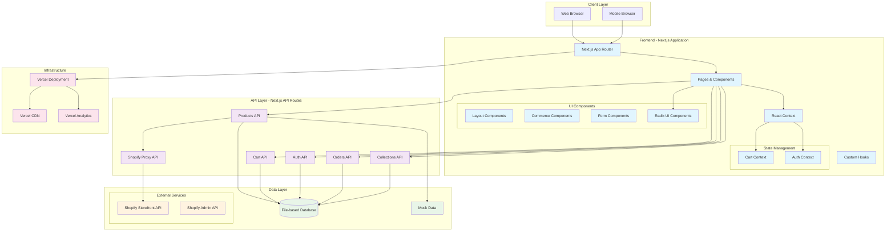

# System Architecture Overview

## High-Level Architecture

## Technology Stack

### Frontend
- **Framework**: Next.js 15 with App Router
- **Language**: TypeScript
- **Styling**: Tailwind CSS
- **UI Components**: Radix UI
- **State Management**: React Context API
- **Forms**: React Hook Form with Zod validation
- **Icons**: Lucide React

### Backend
- **API**: Next.js API Routes
- **Authentication**: JWT with bcryptjs
- **Database**: File-based (development), PostgreSQL (production planned)
- **External APIs**: Shopify Storefront API

### Infrastructure
- **Deployment**: Vercel
- **CDN**: Vercel Edge Network
- **Analytics**: Vercel Analytics
- **Environment**: Node.js

## Key Features

1. **Headless E-commerce**: Shopify backend with custom frontend
2. **Hybrid Data Strategy**: Shopify API with local fallback
3. **Progressive Enhancement**: Works with and without Shopify
4. **Mobile-First Design**: Responsive across all devices
5. **SEO Optimized**: Server-side rendering with Next.js
6. **Performance**: Edge deployment and CDN optimization