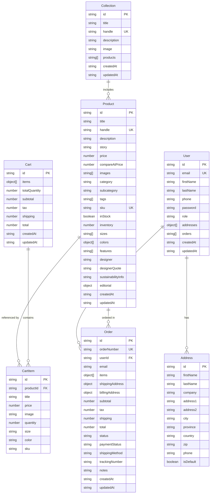

# Database Schema

## Entity Relationship Diagram



## Data Types and Constraints

### Product Entity
- **Primary Key**: `id` (auto-generated)
- **Unique Keys**: `handle`, `sku`
- **Required Fields**: `title`, `description`, `price`, `category`, `sku`
- **Indexes**: `category`, `tags`, `inStock`, `createdAt`

### User Entity
- **Primary Key**: `id` (auto-generated)
- **Unique Keys**: `email`
- **Required Fields**: `email`, `firstName`, `lastName`, `password`
- **Indexes**: `email`, `createdAt`

### Cart Entity
- **Primary Key**: `id` (auto-generated)
- **Required Fields**: `items`, `totalQuantity`, `subtotal`, `total`
- **Indexes**: `createdAt`, `updatedAt`

### Order Entity
- **Primary Key**: `id` (auto-generated)
- **Unique Keys**: `orderNumber`
- **Foreign Keys**: `userId` (references User.id)
- **Required Fields**: `orderNumber`, `email`, `items`, `total`, `status`
- **Indexes**: `userId`, `email`, `status`, `createdAt`

### Collection Entity
- **Primary Key**: `id` (auto-generated)
- **Unique Keys**: `handle`
- **Required Fields**: `title`, `handle`, `description`
- **Indexes**: `handle`, `createdAt`

## Database Implementation

### Current (Development)
```typescript
// File-based JSON storage
class Database<T extends { id: string }> {
  private filename: string
  
  async read(): Promise<T[]>
  async write(data: T[]): Promise<void>
  async findById(id: string): Promise<T | null>
  async create(item: T): Promise<T>
  async update(id: string, updates: Partial<T>): Promise<T | null>
  async delete(id: string): Promise<boolean>
}
```

### Production (Planned)
```sql
-- PostgreSQL Schema
CREATE TABLE products (
  id UUID PRIMARY KEY DEFAULT gen_random_uuid(),
  title VARCHAR(255) NOT NULL,
  handle VARCHAR(255) UNIQUE NOT NULL,
  description TEXT,
  story TEXT,
  price DECIMAL(10,2) NOT NULL,
  compare_at_price DECIMAL(10,2),
  images JSONB DEFAULT '[]',
  category VARCHAR(100) NOT NULL,
  subcategory VARCHAR(100),
  tags JSONB DEFAULT '[]',
  sku VARCHAR(100) UNIQUE NOT NULL,
  in_stock BOOLEAN DEFAULT true,
  inventory INTEGER DEFAULT 0,
  sizes JSONB DEFAULT '[]',
  colors JSONB DEFAULT '[]',
  features JSONB DEFAULT '[]',
  designer VARCHAR(255),
  designer_quote TEXT,
  sustainability_info TEXT,
  editorial JSONB,
  created_at TIMESTAMP DEFAULT NOW(),
  updated_at TIMESTAMP DEFAULT NOW()
);

CREATE INDEX idx_products_category ON products(category);
CREATE INDEX idx_products_in_stock ON products(in_stock);
CREATE INDEX idx_products_created_at ON products(created_at);
```

## Data Flow Patterns

### Product Data Flow
1. **Shopify → API → Frontend**: Primary data source
2. **Local DB → API → Frontend**: Fallback when Shopify unavailable
3. **Mock Data → API → Frontend**: Development/demo mode

### Cart Data Flow
1. **Frontend → Cart API → Local Storage**: Session persistence
2. **Cart API → Database**: Server-side cart storage
3. **Database → Cart API → Frontend**: Cart retrieval

### Order Data Flow
1. **Checkout → Order API → Database**: Order creation
2. **Order API → Email Service**: Order confirmation
3. **Admin → Order API → Database**: Order management

## Scalability Considerations

### Current Limitations
- File-based storage not suitable for production
- No connection pooling
- Limited concurrent access
- No data replication

### Production Recommendations
- **PostgreSQL** with connection pooling
- **Redis** for session/cart caching
- **Database replication** for high availability
- **Horizontal scaling** with read replicas