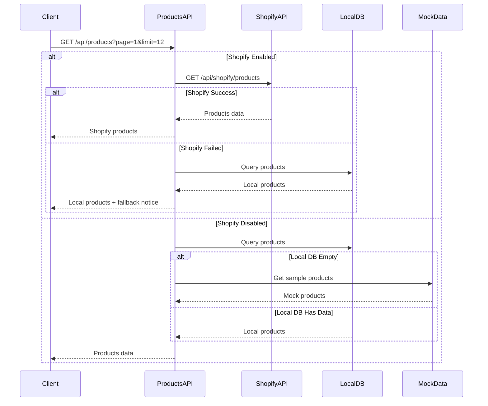
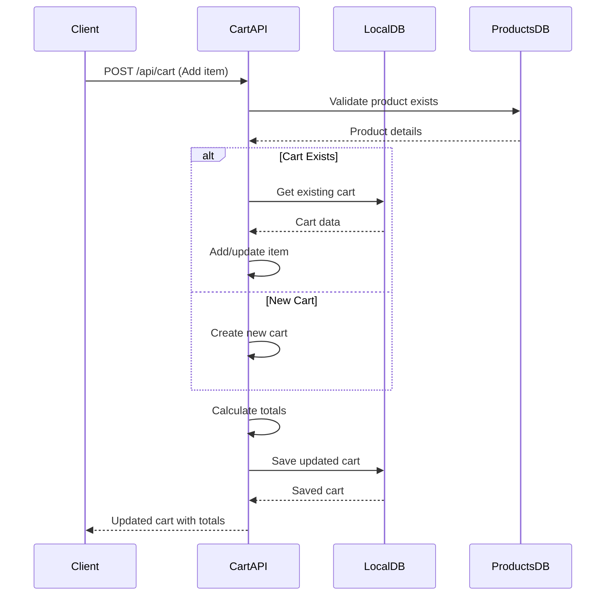
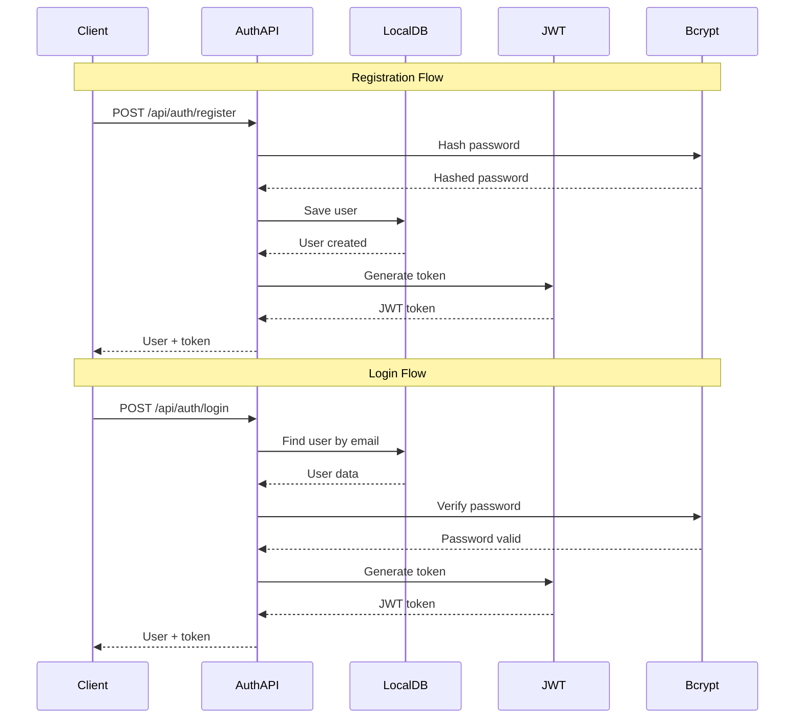
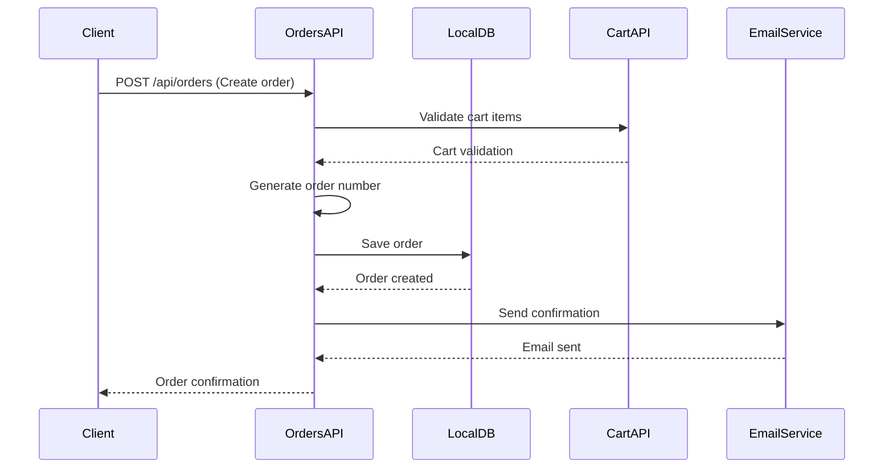
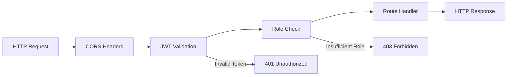

# API Architecture

## API Endpoints Overview

```mermaid
graph TB
    subgraph "Frontend Application"
        Pages[Next.js Pages]
        Components[React Components]
        Context[Context Providers]
    end
    
    subgraph "API Layer (/api)"
        subgraph "Core APIs"
            ProductsAPI["/api/products"]
            CartAPI["/api/cart"]
            OrdersAPI["/api/orders"]
            CollectionsAPI["/api/collections"]
            UsersAPI["/api/users"]
        end
        
        subgraph "Authentication"
            LoginAPI["/api/auth/login"]
            RegisterAPI["/api/auth/register"]
        end
        
        subgraph "Shopify Integration"
            ShopifyProducts["/api/shopify/products"]
            ShopifyCart["/api/shopify/cart"]
            ShopifyCheckout["/api/shopify/checkout"]
            ShopifyCollections["/api/shopify/collections"]
        end
        
        subgraph "Admin APIs"
            AdminDashboard["/api/admin/dashboard"]
        end
        
        subgraph "Utility APIs"
            InventoryAPI["/api/inventory"]
        end
    end
    
    subgraph "Data Sources"
        LocalDB[(Local Database)]
        ShopifyAPI[Shopify Storefront API]
        MockData[Mock Data]
    end
    
    Pages --> ProductsAPI
    Pages --> CartAPI
    Pages --> OrdersAPI
    Pages --> CollectionsAPI
    Pages --> LoginAPI
    Pages --> RegisterAPI
    
    Components --> ProductsAPI
    Components --> CartAPI
    Context --> CartAPI
    Context --> LoginAPI
    
    ProductsAPI --> ShopifyProducts
    ProductsAPI --> LocalDB
    ProductsAPI --> MockData
    
    CartAPI --> LocalDB
    OrdersAPI --> LocalDB
    CollectionsAPI --> LocalDB
    UsersAPI --> LocalDB
    LoginAPI --> LocalDB
    RegisterAPI --> LocalDB
    
    ShopifyProducts --> ShopifyAPI
    ShopifyCart --> ShopifyAPI
    ShopifyCheckout --> ShopifyAPI
    ShopifyCollections --> ShopifyAPI
    
    AdminDashboard --> LocalDB
    InventoryAPI --> LocalDB
    
    classDef frontend fill:#e1f5fe
    classDef api fill:#f3e5f5
    classDef shopify fill:#fff3e0
    classDef data fill:#e8f5e8
    
    class Pages,Components,Context frontend
    class ProductsAPI,CartAPI,OrdersAPI,CollectionsAPI,UsersAPI,LoginAPI,RegisterAPI,AdminDashboard,InventoryAPI api
    class ShopifyProducts,ShopifyCart,ShopifyCheckout,ShopifyCollections shopify
    class LocalDB,ShopifyAPI,MockData data
```



## API Endpoint Details

### Products API (`/api/products`)



**Endpoints:**
- `GET /api/products` - List products with pagination and filters
- `GET /api/products/[id]` - Get single product by ID
- `POST /api/products` - Create new product (admin)
- `PUT /api/products/[id]` - Update product (admin)
- `DELETE /api/products/[id]` - Delete product (admin)

**Query Parameters:**
- `page`: Page number (default: 1)
- `limit`: Items per page (default: 12)
- `category`: Filter by category
- `tag`: Filter by tag
- `search`: Search query

### Cart API (`/api/cart`)



**Endpoints:**
- `GET /api/cart?cartId=xyz` - Get cart by ID or create new
- `POST /api/cart` - Add item to cart
- `PUT /api/cart` - Update cart item quantity
- `DELETE /api/cart` - Remove item from cart

### Authentication API (`/api/auth/*`)



**Endpoints:**
- `POST /api/auth/register` - Create new user account
- `POST /api/auth/login` - Authenticate user

### Orders API (`/api/orders`)



**Endpoints:**
- `GET /api/orders` - List orders (filtered by user/email)
- `GET /api/orders/[id]` - Get single order
- `POST /api/orders` - Create new order
- `PUT /api/orders/[id]` - Update order status (admin)

## API Response Format

### Standard Response Structure
```typescript
interface ApiResponse<T = any> {
  success: boolean
  data?: T
  error?: string
  message?: string
}

interface PaginatedResponse<T> extends ApiResponse<T[]> {
  pagination: {
    page: number
    limit: number
    total: number
    totalPages: number
  }
}
```

### Error Handling
```typescript
// Error Response Examples
{
  "success": false,
  "error": "Product not found",
  "code": "PRODUCT_NOT_FOUND"
}

{
  "success": false,
  "error": "Validation failed",
  "details": {
    "email": "Invalid email format",
    "password": "Password too short"
  }
}
```

## Authentication & Authorization

### JWT Token Structure
```typescript
interface JWTPayload {
  userId: string
  email: string
  role: string // 'customer' | 'admin'
  iat: number
  exp: number
}
```

### Protected Routes
- **Admin Only**: Product CRUD, Order management, User management
- **Authenticated**: Profile, Order history, Address management
- **Public**: Product browsing, Cart operations, Registration

### Middleware Chain


## Rate Limiting & Security

### Current Implementation
- **CORS**: Configured for frontend domain
- **JWT**: 7-day expiration with secure secret
- **Password**: bcrypt with 12 salt rounds
- **Input Validation**: Zod schemas for request validation

### Production Recommendations
- **Rate Limiting**: 100 requests/minute per IP
- **API Keys**: For admin operations
- **Request Logging**: For monitoring and debugging
- **Input Sanitization**: XSS and injection prevention