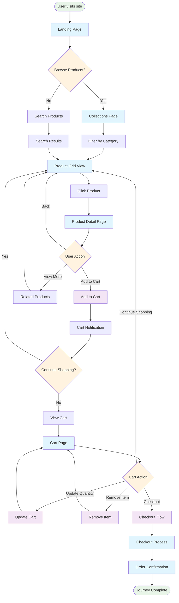
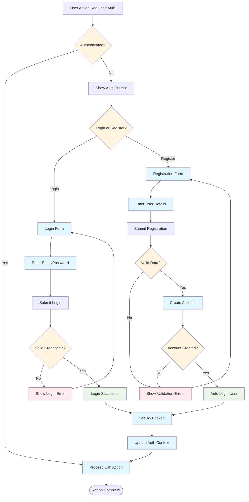
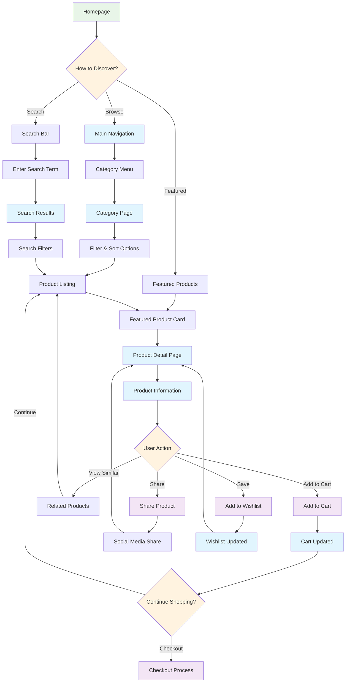
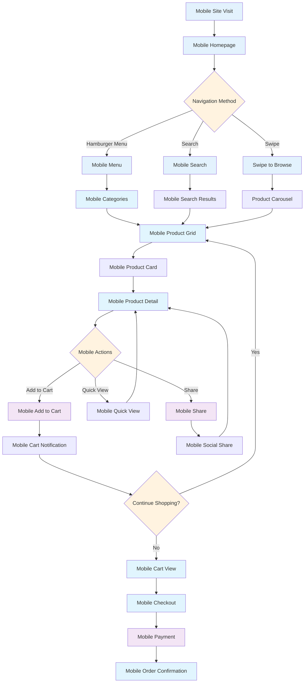

# User Journey Flow Diagrams

## Customer Browse & Purchase Journey

## Detailed Checkout Flow

```mermaid
flowchart TD
    CartPage[Cart Page] --> CheckoutBtn[Click Checkout]
    CheckoutBtn --> AuthCheck{User Authenticated?}
    
    AuthCheck -->|No| GuestCheckout{Guest Checkout?}
    AuthCheck -->|Yes| Step1[Step 1: Information]
    
    GuestCheckout -->|Yes| Step1
    GuestCheckout -->|No| LoginPrompt[Login/Register]
    
    LoginPrompt --> LoginForm[Login Form]
    LoginForm --> LoginSubmit{Login Success?}
    LoginSubmit -->|Yes| Step1
    LoginSubmit -->|No| LoginError[Show Error]
    LoginError --> LoginForm
    
    Step1 --> ContactInfo[Enter Contact Info]
    ContactInfo --> ShippingInfo[Enter Shipping Address]
    ShippingInfo --> ValidateStep1{Validation OK?}
    
    ValidateStep1 -->|No| Step1Error[Show Validation Errors]
    ValidateStep1 -->|Yes| Step2[Step 2: Shipping Method]
    
    Step1Error --> Step1
    
    Step2 --> ShippingOptions[Select Shipping Method]
    ShippingOptions --> BillingAddress[Billing Address]
    BillingAddress --> SameAsShipping{Same as Shipping?}
    
    SameAsShipping -->|Yes| Step3[Step 3: Payment]
    SameAsShipping -->|No| BillingForm[Enter Billing Address]
    BillingForm --> ValidateStep2{Validation OK?}
    
    ValidateStep2 -->|No| Step2Error[Show Validation Errors]
    ValidateStep2 -->|Yes| Step3
    
    Step2Error --> Step2
    
    Step3 --> PaymentMethod[Select Payment Method]
    PaymentMethod --> CreditCard{Credit Card?}
    
    CreditCard -->|Yes| CardForm[Enter Card Details]
    CreditCard -->|No| PayPal[PayPal Checkout]
    
    CardForm --> ValidatePayment{Payment Valid?}
    PayPal --> PayPalAuth[PayPal Authentication]
    PayPalAuth --> ValidatePayment
    
    ValidatePayment -->|No| PaymentError[Show Payment Error]
    ValidatePayment -->|Yes| ReviewOrder[Review Order]
    
    PaymentError --> Step3
    
    ReviewOrder --> PlaceOrder[Place Order Button]
    PlaceOrder --> ProcessOrder[Process Order]
    ProcessOrder --> OrderSuccess{Order Created?}
    
    OrderSuccess -->|Yes| Confirmation[Order Confirmation]
    OrderSuccess -->|No| OrderError[Order Error]
    
    OrderError --> ReviewOrder
    Confirmation --> EmailConfirmation[Send Email Confirmation]
    EmailConfirmation --> ThankYou[Thank You Page]
    
    classDef process fill:#e1f5fe
    classDef decision fill:#fff3e0
    classDef error fill:#ffebee
    classDef success fill:#e8f5e8
    
    class CartPage,Step1,Step2,Step3,ContactInfo,ShippingInfo,ShippingOptions,BillingForm,CardForm,ReviewOrder,ProcessOrder,Confirmation,ThankYou process
    class AuthCheck,GuestCheckout,LoginSubmit,ValidateStep1,ValidateStep2,SameAsShipping,CreditCard,ValidatePayment,OrderSuccess decision
    class Step1Error,Step2Error,PaymentError,OrderError,LoginError error
    class EmailConfirmation success
```

## User Authentication Journey

## Product Discovery Journey

## Mobile User Experience Flow

## Key User Experience Metrics

### Conversion Funnel
1. **Homepage Visit** → **Product Discovery** (85%)
2. **Product Discovery** → **Product View** (45%)
3. **Product View** → **Add to Cart** (25%)
4. **Add to Cart** → **Checkout Start** (70%)
5. **Checkout Start** → **Order Complete** (60%)

### Critical User Paths
- **Quick Purchase**: Homepage → Search → Product → Add to Cart → Checkout (< 3 minutes)
- **Browse & Compare**: Homepage → Category → Filter → Compare → Purchase (5-10 minutes)
- **Mobile Shopping**: Mobile optimized flow with touch-friendly interactions

### User Experience Principles
- **Progressive Disclosure**: Show information as needed
- **Mobile-First**: Optimized for mobile devices
- **Guest Checkout**: No forced registration
- **Clear Navigation**: Intuitive category structure
- **Trust Signals**: Security badges, reviews, return policy