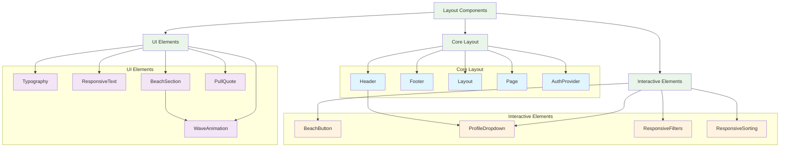
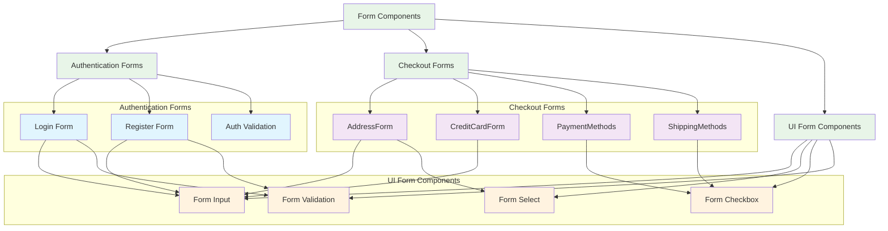

# React Component Hierarchy

## Application Component Tree

```mermaid
graph TD
    RootLayout[RootLayout - app/layout.tsx] --> AuthProvider[AuthProvider]
    AuthProvider --> CartProvider[CartProvider]
    CartProvider --> Header[Header]
    CartProvider --> Main[Main Content]
    CartProvider --> Footer[Footer]
    
    Header --> Navigation[Navigation Menu]
    Header --> SearchDialog[Search Dialog]
    Header --> MiniCart[Mini Cart]
    Header --> ProfileDropdown[Profile Dropdown]
    
    Main --> PageComponents[Page Components]
    
    subgraph "Page Components"
        HomePage[HomePage - app/page.tsx]
        ProductsPage[ProductsPage - app/products/page.tsx]
        ProductDetailPage[ProductDetailPage - app/products/[id]/page.tsx]
        CollectionsPage[CollectionsPage - app/collections/page.tsx]
        CartPage[CartPage - app/cart/page.tsx]
        CheckoutPage[CheckoutPage - app/checkout/page.tsx]
        AuthPages[Auth Pages - app/auth/*/page.tsx]
        ProfilePage[ProfilePage - app/profile/page.tsx]
    end
    
    PageComponents --> HomePage
    PageComponents --> ProductsPage
    PageComponents --> ProductDetailPage
    PageComponents --> CollectionsPage
    PageComponents --> CartPage
    PageComponents --> CheckoutPage
    PageComponents --> AuthPages
    PageComponents --> ProfilePage
    
    classDef layout fill:#e8f5e8
    classDef provider fill:#e1f5fe
    classDef page fill:#f3e5f5
    classDef component fill:#fff3e0
    
    class RootLayout layout
    class AuthProvider,CartProvider provider
    class HomePage,ProductsPage,ProductDetailPage,CollectionsPage,CartPage,CheckoutPage,AuthPages,ProfilePage page
    class Header,Footer,Navigation,SearchDialog,MiniCart,ProfileDropdown component
```

## Commerce Components Hierarchy

```mermaid
graph TD
    CommerceComponents[Commerce Components] --> ProductComponents[Product Components]
    CommerceComponents --> CartComponents[Cart Components]
    CommerceComponents --> OrderComponents[Order Components]
    
    subgraph "Product Components"
        ProductCard[ProductCard]
        ProductDetails[ProductDetails]
        ProductImageGallery[ProductImageGallery]
        ProductStory[ProductStory]
        ProductTag[ProductTag]
        ProductHotspot[ProductHotspot]
        RelatedProducts[RelatedProducts]
        ResponsiveProductGrid[ResponsiveProductGrid]
        MagazineProductCard[MagazineProductCard]
        MagazineFeaturedProducts[MagazineFeaturedProducts]
        EditorialProductFeature[EditorialProductFeature]
    end
    
    subgraph "Cart Components"
        CartProvider2[CartProvider]
        MiniCart2[MiniCart]
        ProductToast[ProductToast]
        OrderSummary[OrderSummary]
    end
    
    ProductComponents --> ProductCard
    ProductComponents --> ProductDetails
    ProductComponents --> ProductImageGallery
    ProductComponents --> ProductStory
    ProductComponents --> ProductTag
    ProductComponents --> ProductHotspot
    ProductComponents --> RelatedProducts
    ProductComponents --> ResponsiveProductGrid
    ProductComponents --> MagazineProductCard
    ProductComponents --> MagazineFeaturedProducts
    ProductComponents --> EditorialProductFeature
    
    CartComponents --> CartProvider2
    CartComponents --> MiniCart2
    CartComponents --> ProductToast
    CartComponents --> OrderSummary
    
    ProductCard --> ProductTag
    ProductDetails --> ProductImageGallery
    ProductDetails --> ProductStory
    ResponsiveProductGrid --> ProductCard
    MagazineFeaturedProducts --> MagazineProductCard
    
    classDef category fill:#e8f5e8
    classDef product fill:#e1f5fe
    classDef cart fill:#f3e5f5
    
    class CommerceComponents,ProductComponents,CartComponents,OrderComponents category
    class ProductCard,ProductDetails,ProductImageGallery,ProductStory,ProductTag,ProductHotspot,RelatedProducts,ResponsiveProductGrid,MagazineProductCard,MagazineFeaturedProducts,EditorialProductFeature product
    class CartProvider2,MiniCart2,ProductToast,OrderSummary cart
```



## Layout Components Structure



## Form Components Architecture



## UI Components (Radix UI Integration)

```mermaid
graph TD
    UIComponents[UI Components - src/components/ui/] --> Navigation[Navigation]
    UIComponents --> DataDisplay[Data Display]
    UIComponents --> Feedback[Feedback]
    UIComponents --> Inputs[Inputs]
    UIComponents --> Layout[Layout]
    UIComponents --> Overlay[Overlay]
    
    subgraph "Navigation"
        NavigationMenu[NavigationMenu]
        Breadcrumb[Breadcrumb]
        Pagination[Pagination]
        Menubar[Menubar]
    end
    
    subgraph "Data Display"
        Card[Card]
        Table[Table]
        Badge[Badge]
        Avatar[Avatar]
        Separator[Separator]
        AspectRatio[AspectRatio]
    end
    
    subgraph "Feedback"
        Alert[Alert]
        Toast[Toast]
        Progress[Progress]
        Skeleton[Skeleton]
    end
    
    subgraph "Inputs"
        Button[Button]
        Input[Input]
        Select[Select]
        Checkbox[Checkbox]
        RadioGroup[RadioGroup]
        Switch[Switch]
        Slider[Slider]
        Textarea[Textarea]
    end
    
    subgraph "Layout"
        Accordion[Accordion]
        Collapsible[Collapsible]
        Tabs[Tabs]
        Resizable[Resizable]
        ScrollArea[ScrollArea]
        Sidebar[Sidebar]
    end
    
    subgraph "Overlay"
        Dialog[Dialog]
        AlertDialog[AlertDialog]
        Sheet[Sheet]
        Drawer[Drawer]
        Popover[Popover]
        Tooltip[Tooltip]
        HoverCard[HoverCard]
        ContextMenu[ContextMenu]
        DropdownMenu[DropdownMenu]
    end
    
    Navigation --> NavigationMenu
    Navigation --> Breadcrumb
    Navigation --> Pagination
    Navigation --> Menubar
    
    DataDisplay --> Card
    DataDisplay --> Table
    DataDisplay --> Badge
    DataDisplay --> Avatar
    DataDisplay --> Separator
    DataDisplay --> AspectRatio
    
    Feedback --> Alert
    Feedback --> Toast
    Feedback --> Progress
    Feedback --> Skeleton
    
    Inputs --> Button
    Inputs --> Input
    Inputs --> Select
    Inputs --> Checkbox
    Inputs --> RadioGroup
    Inputs --> Switch
    Inputs --> Slider
    Inputs --> Textarea
    
    Layout --> Accordion
    Layout --> Collapsible
    Layout --> Tabs
    Layout --> Resizable
    Layout --> ScrollArea
    Layout --> Sidebar
    
    Overlay --> Dialog
    Overlay --> AlertDialog
    Overlay --> Sheet
    Overlay --> Drawer
    Overlay --> Popover
    Overlay --> Tooltip
    Overlay --> HoverCard
    Overlay --> ContextMenu
    Overlay --> DropdownMenu
    
    classDef category fill:#e8f5e8
    classDef nav fill:#e1f5fe
    classDef data fill:#f3e5f5
    classDef feedback fill:#fff3e0
    classDef input fill:#e8f5e8
    classDef layout fill:#fce4ec
    classDef overlay fill:#f1f8e9
    
    class UIComponents,Navigation,DataDisplay,Feedback,Inputs,Layout,Overlay category
    class NavigationMenu,Breadcrumb,Pagination,Menubar nav
    class Card,Table,Badge,Avatar,Separator,AspectRatio data
    class Alert,Toast,Progress,Skeleton feedback
    class Button,Input,Select,Checkbox,RadioGroup,Switch,Slider,Textarea input
    class Accordion,Collapsible,Tabs,Resizable,ScrollArea,Sidebar layout
    class Dialog,AlertDialog,Sheet,Drawer,Popover,Tooltip,HoverCard,ContextMenu,DropdownMenu overlay
```



## Component Props & State Flow

### Key Component Interfaces

```typescript
// Product Components
interface ProductCardProps {
  product: Product
  variant?: 'default' | 'magazine' | 'featured'
  showQuickAdd?: boolean
  className?: string
}

interface ProductDetailsProps {
  product: Product
  selectedVariant?: ProductVariant
  onVariantChange: (variant: ProductVariant) => void
  onAddToCart: (item: CartItem) => void
}

// Cart Components
interface CartProviderProps {
  children: React.ReactNode
}

interface CartContextType {
  cart: Cart | null
  totalQuantity: number
  loading: boolean
  error: string | null
  addToCart: (product: AddToCartParams) => Promise<void>
  removeFromCart: (itemId: string) => Promise<void>
  updateLineQuantity: (itemId: string, quantity: number) => Promise<void>
}

// Layout Components
interface HeaderProps {
  shop: {
    name: string
    logo?: string
  }
}

interface AuthProviderProps {
  children: React.ReactNode
}

interface AuthContextType {
  user: User | null
  isAuthenticated: boolean
  login: (credentials: LoginCredentials) => Promise<void>
  logout: () => void
  register: (userData: RegisterData) => Promise<void>
}
```

## Component Reusability Patterns

### Composition Pattern
- **Layout Components**: Composable layout building blocks
- **Form Components**: Reusable form elements with validation
- **UI Components**: Atomic design system components

### Render Props Pattern
- **Data Fetching**: Components that handle API calls
- **State Management**: Components that manage complex state

### Custom Hooks Pattern
- **useCart**: Cart state and operations
- **useAuth**: Authentication state and operations
- **useMediaQuery**: Responsive design utilities
- **useResponsiveFont**: Dynamic font sizing

### Component Categories by Responsibility

1. **Presentational Components**: Pure UI components with no business logic
2. **Container Components**: Components that handle data fetching and state
3. **Provider Components**: Context providers for global state
4. **Page Components**: Route-level components that compose other components
5. **Utility Components**: Helper components for common functionality