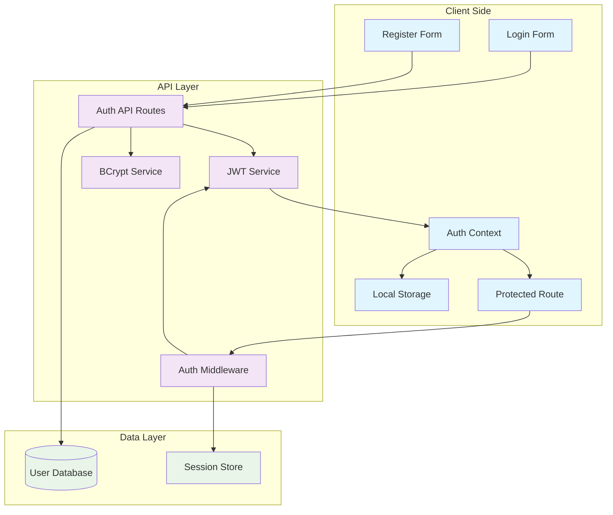
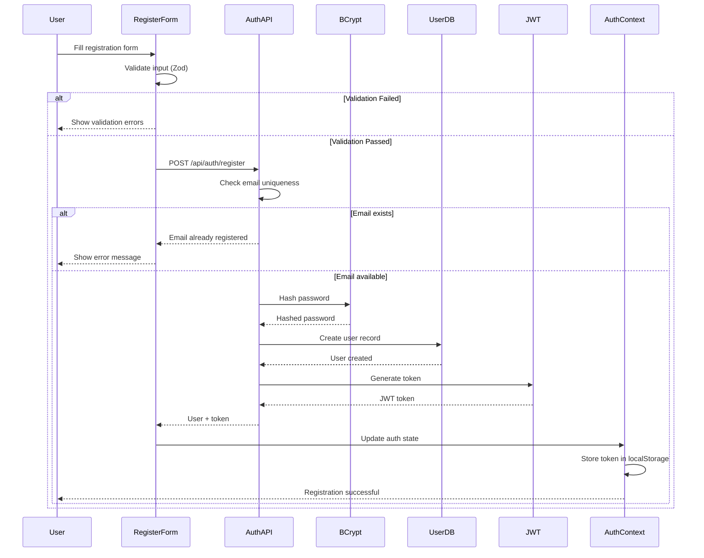
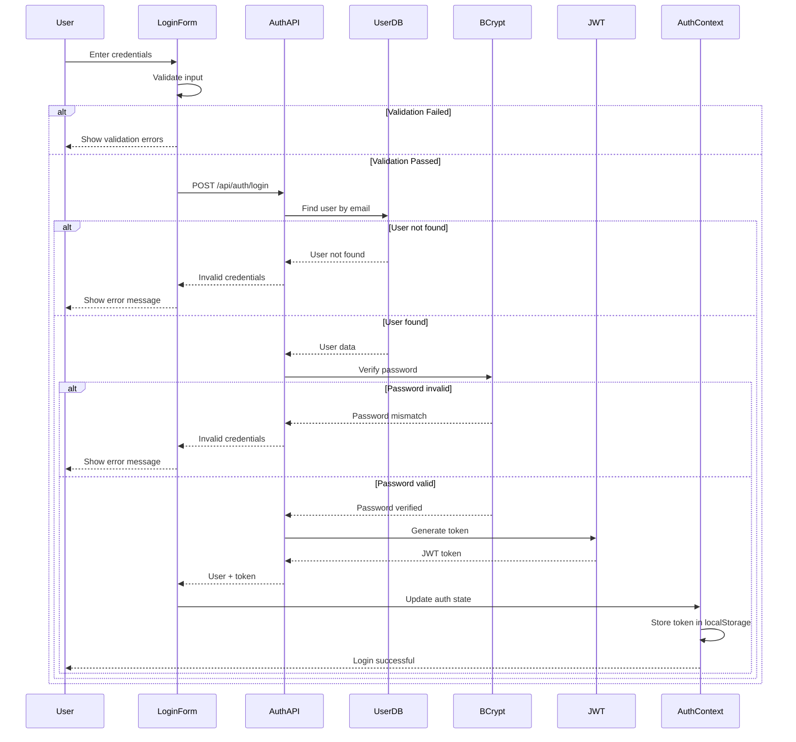
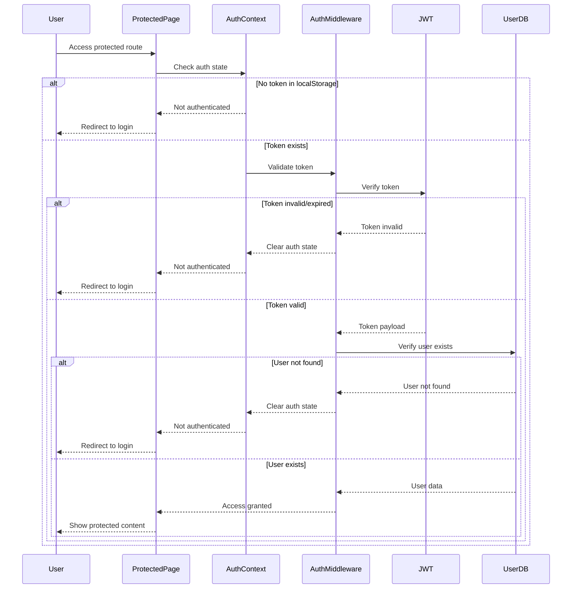
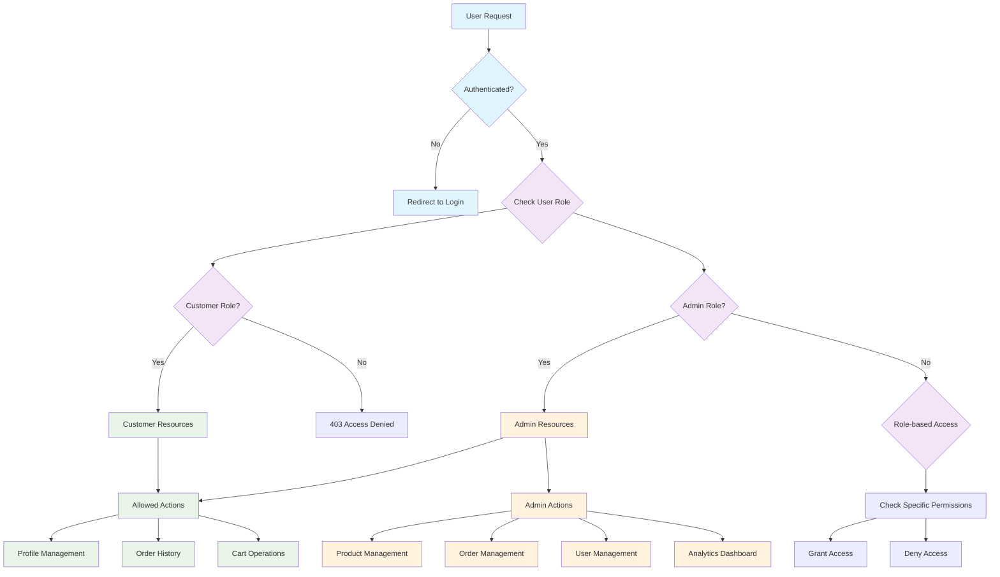
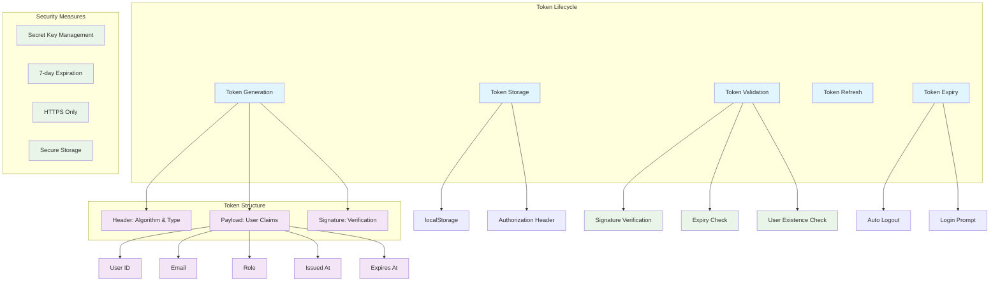
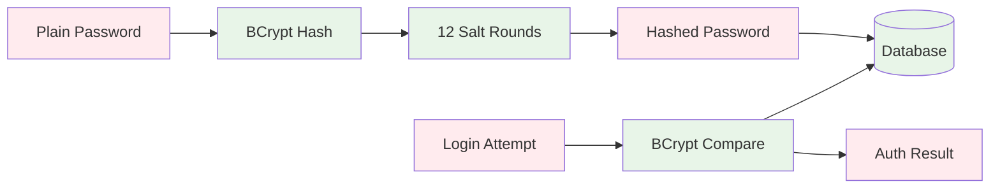

# Authentication & Authorization Flow

## Authentication Architecture Overview



## User Registration Flow



## User Login Flow



## Protected Route Access Flow



## Role-Based Authorization Flow



## JWT Token Management



## Authentication Context Implementation

```typescript
// Auth Context Type Definition
interface AuthContextType {
  user: User | null
  isAuthenticated: boolean
  loading: boolean
  error: string | null
  login: (credentials: LoginCredentials) => Promise<void>
  register: (userData: RegisterData) => Promise<void>
  logout: () => void
  clearError: () => void
}

// Auth Provider Implementation Flow
const AuthProvider = ({ children }) => {
  // 1. Initialize state from localStorage
  // 2. Validate existing token on mount
  // 3. Provide auth methods to children
  // 4. Handle token expiry
  // 5. Manage loading and error states
}
```

## Security Considerations

### Password Security


### Token Security
- **Secret Key**: Environment variable, never exposed to client
- **Expiration**: 7-day expiry to limit exposure window
- **HTTPS Only**: Tokens only transmitted over secure connections
- **No Sensitive Data**: Tokens contain minimal user information

### Authorization Levels

1. **Public Routes**: No authentication required
   - Homepage, product browsing, registration, login

2. **Authenticated Routes**: Valid JWT required
   - Profile management, order history, checkout

3. **Admin Routes**: Admin role required
   - Product management, order management, user management

4. **Owner Routes**: Resource ownership required
   - Edit own profile, view own orders

### Error Handling

```typescript
// Authentication Errors
enum AuthError {
  INVALID_CREDENTIALS = 'Invalid email or password',
  EMAIL_EXISTS = 'Email already registered',
  TOKEN_EXPIRED = 'Session expired, please login again',
  TOKEN_INVALID = 'Invalid authentication token',
  ACCESS_DENIED = 'Access denied',
  USER_NOT_FOUND = 'User account not found'
}
```

### Session Management

- **Client-side**: JWT stored in localStorage
- **Server-side**: Stateless authentication (no server sessions)
- **Token Refresh**: Manual re-authentication after expiry
- **Logout**: Clear localStorage and redirect to login

### Future Enhancements

1. **Refresh Tokens**: Implement refresh token rotation
2. **Multi-factor Authentication**: Add 2FA support
3. **OAuth Integration**: Social login (Google, Facebook)
4. **Session Management**: Server-side session tracking
5. **Rate Limiting**: Prevent brute force attacks
6. **Account Lockout**: Temporary lockout after failed attempts