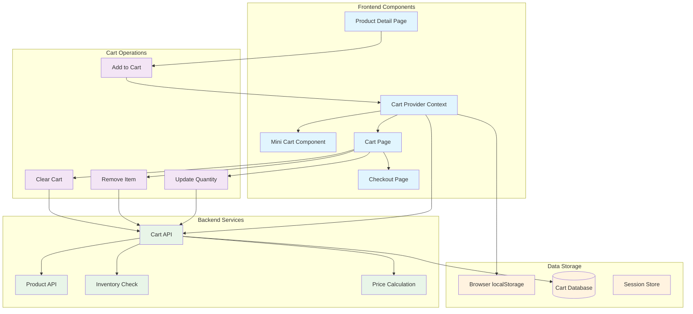
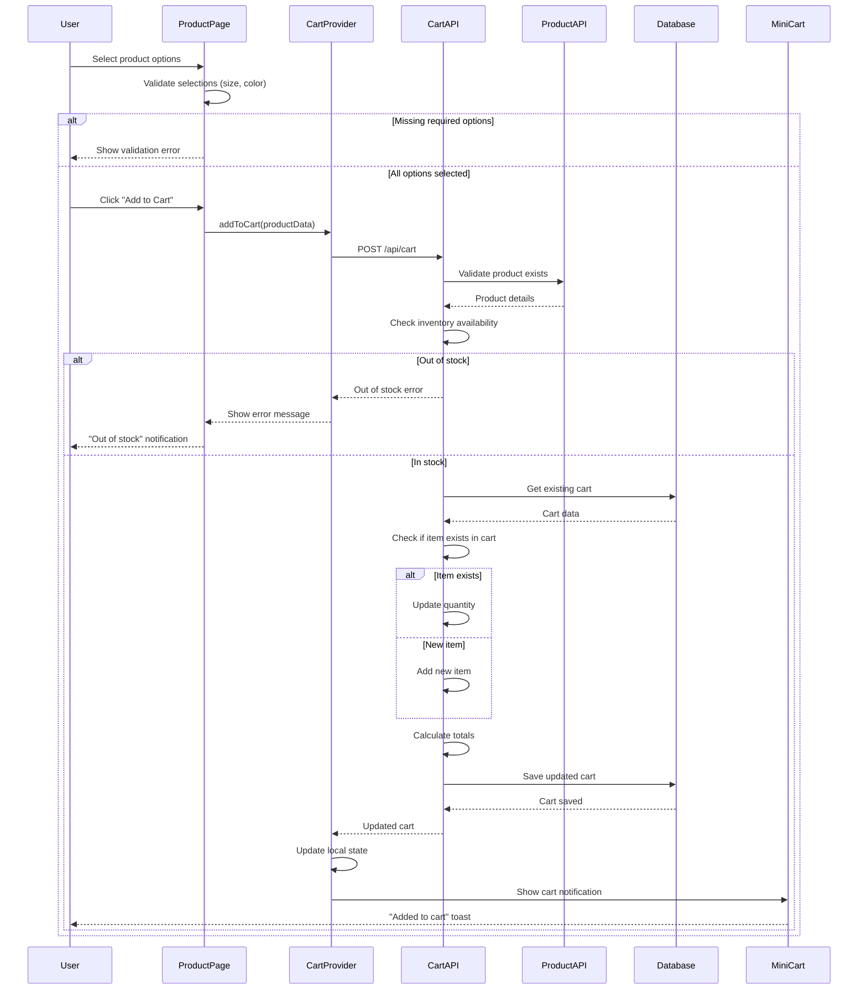
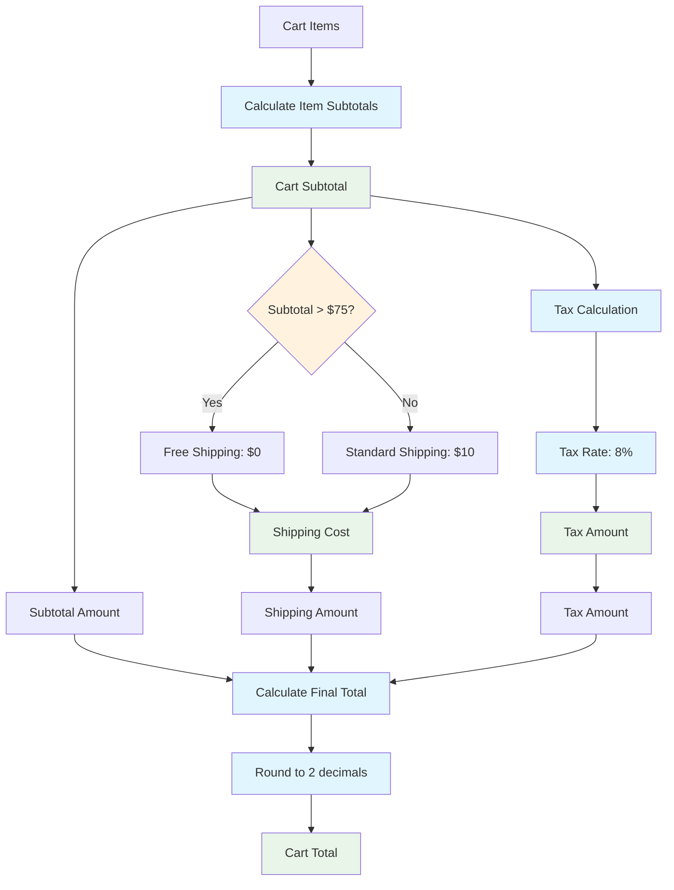
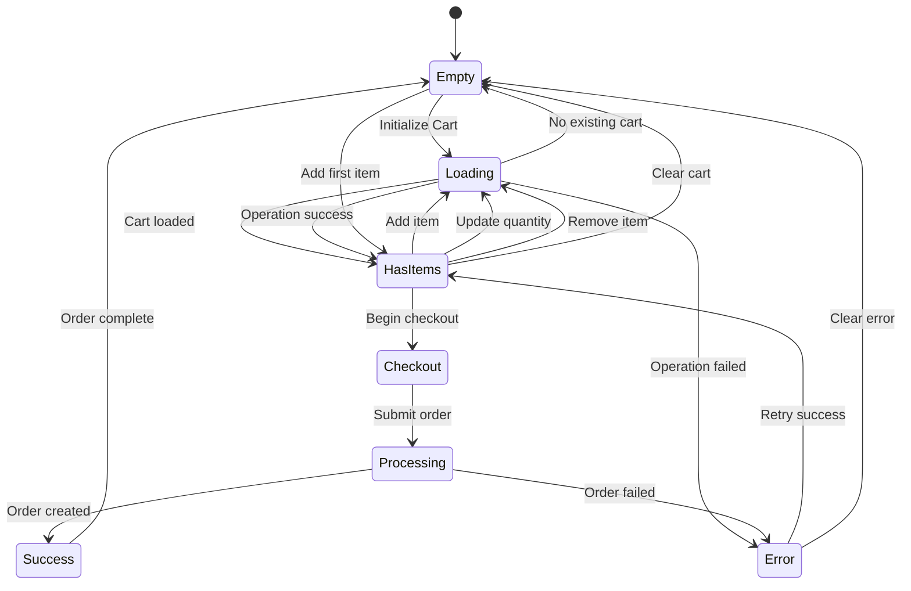
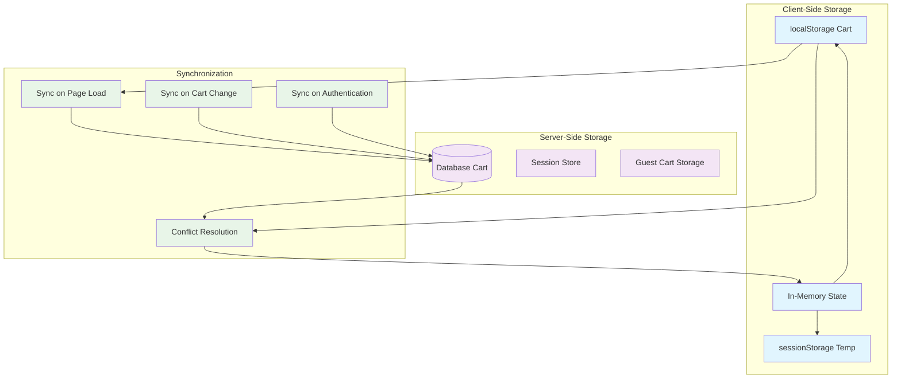
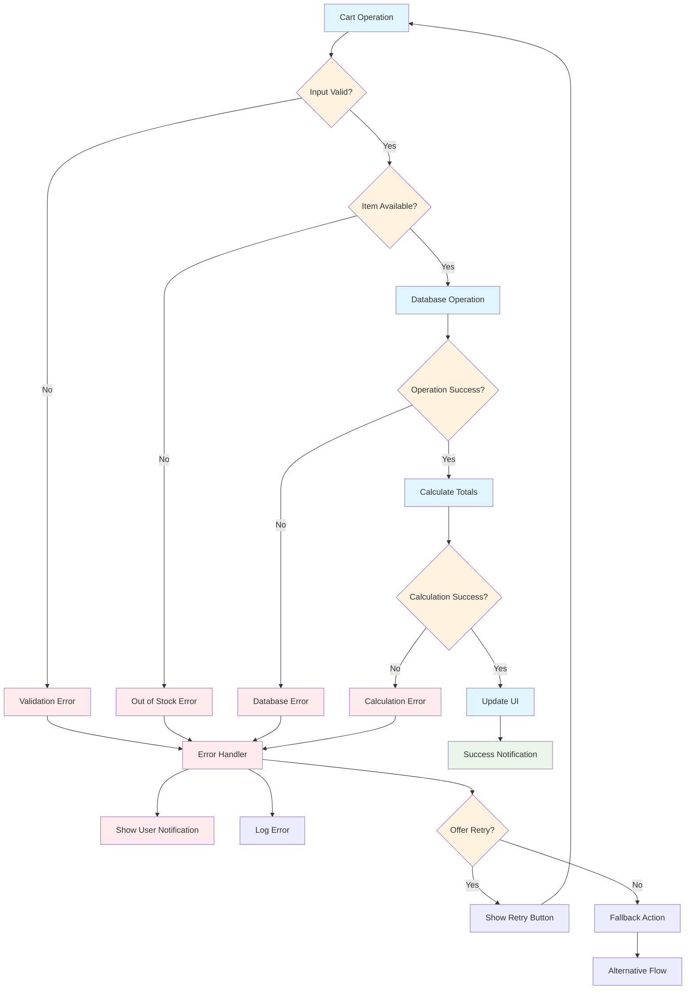

# Cart & Checkout Process Flow

## Cart Management Architecture



## Add to Cart Flow



## Cart Calculation Logic



## Checkout Process Flow

```mermaid
flowchart TD
    CartPage[Cart Page] --> CheckoutButton[Checkout Button]
    CheckoutButton --> AuthenticationCheck{User Authenticated?}
    
    AuthenticationCheck -->|No| GuestCheckout{Allow Guest Checkout?}
    AuthenticationCheck -->|Yes| CheckoutStep1[Step 1: Information]
    
    GuestCheckout -->|Yes| CheckoutStep1
    GuestCheckout -->|No| LoginRequired[Login Required]
    LoginRequired --> LoginPage[Login/Register Page]
    LoginPage --> CheckoutStep1
    
    CheckoutStep1 --> ContactInformation[Contact Information]
    ContactInformation --> ShippingAddress[Shipping Address]
    ShippingAddress --> ValidateStep1{Validate Information}
    
    ValidateStep1 -->|Invalid| Step1Errors[Show Validation Errors]
    ValidateStep1 -->|Valid| CheckoutStep2[Step 2: Shipping]
    
    Step1Errors --> CheckoutStep1
    
    CheckoutStep2 --> ShippingMethod[Select Shipping Method]
    ShippingMethod --> BillingAddress[Billing Address]
    BillingAddress --> SameAsShipping{Same as Shipping?}
    
    SameAsShipping -->|Yes| CheckoutStep3[Step 3: Payment]
    SameAsShipping -->|No| BillingForm[Enter Billing Address]
    BillingForm --> ValidateStep2{Validate Addresses}
    
    ValidateStep2 -->|Invalid| Step2Errors[Show Validation Errors]
    ValidateStep2 -->|Valid| CheckoutStep3
    
    Step2Errors --> CheckoutStep2
    
    CheckoutStep3 --> PaymentMethod[Select Payment Method]
    PaymentMethod --> CreditCardForm[Credit Card Form]
    PaymentMethod --> PayPalOption[PayPal Option]
    
    CreditCardForm --> ValidatePayment{Validate Payment}
    PayPalOption --> PayPalAuth[PayPal Authentication]
    PayPalAuth --> ValidatePayment
    
    ValidatePayment -->|Invalid| PaymentErrors[Show Payment Errors]
    ValidatePayment -->|Valid| OrderReview[Order Review]
    
    PaymentErrors --> CheckoutStep3
    
    OrderReview --> PlaceOrderButton[Place Order Button]
    PlaceOrderButton --> ProcessOrder[Process Order]
    
    ProcessOrder --> CreateOrder[Create Order Record]
    CreateOrder --> InventoryReservation[Reserve Inventory]
    InventoryReservation --> PaymentProcessing[Process Payment]
    PaymentProcessing --> OrderConfirmation[Order Confirmation]
    
    OrderConfirmation --> EmailNotification[Send Email Confirmation]
    OrderConfirmation --> ClearCart[Clear Cart]
    OrderConfirmation --> ThankYouPage[Thank You Page]
    
    classDef process fill:#e1f5fe
    classDef decision fill:#fff3e0
    classDef error fill:#ffebee
    classDef success fill:#e8f5e8
    
    class ContactInformation,ShippingAddress,ShippingMethod,BillingForm,CreditCardForm,OrderReview,ProcessOrder,CreateOrder process
    class AuthenticationCheck,GuestCheckout,ValidateStep1,ValidateStep2,SameAsShipping,ValidatePayment decision
    class Step1Errors,Step2Errors,PaymentErrors error
    class OrderConfirmation,EmailNotification,ThankYouPage success
```



## Cart State Management



## Cart Persistence Strategy



## Error Handling in Cart Operations



## Cart Performance Optimizations

### Debounced Updates
```typescript
// Debounce cart updates to prevent excessive API calls
const debouncedUpdateCart = useMemo(
  () => debounce(updateCartQuantity, 500),
  [updateCartQuantity]
)
```

### Optimistic Updates
```typescript
// Update UI immediately, rollback on error
const optimisticUpdate = async (itemId: string, quantity: number) => {
  // 1. Update UI immediately
  setCartItems(prev => updateItemQuantity(prev, itemId, quantity))
  
  try {
    // 2. Send API request
    await cartApi.updateItem({ cartId, itemId, quantity })
  } catch (error) {
    // 3. Rollback on error
    setCartItems(prev => rollbackUpdate(prev, itemId))
    showError('Failed to update cart')
  }
}
```

### Cart Metrics & Analytics

1. **Conversion Metrics**
   - Add to cart rate: 25%
   - Cart abandonment rate: 70%
   - Checkout completion rate: 60%

2. **Performance Metrics**
   - Add to cart response time: < 200ms
   - Cart page load time: < 1s
   - Checkout step completion time: < 30s

3. **User Behavior**
   - Average items per cart: 2.3
   - Average cart value: $85
   - Most common abandonment point: Shipping step

### Cart Security Considerations

- **Price Validation**: Server-side price verification
- **Inventory Checks**: Real-time stock validation
- **Session Security**: Secure cart session management
- **Input Sanitization**: Prevent XSS in cart data
- **Rate Limiting**: Prevent cart spam/abuse