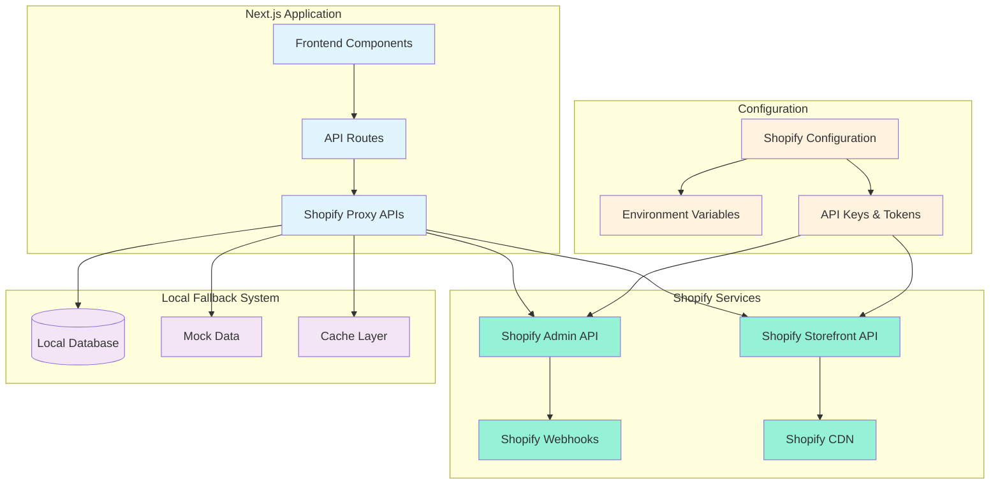
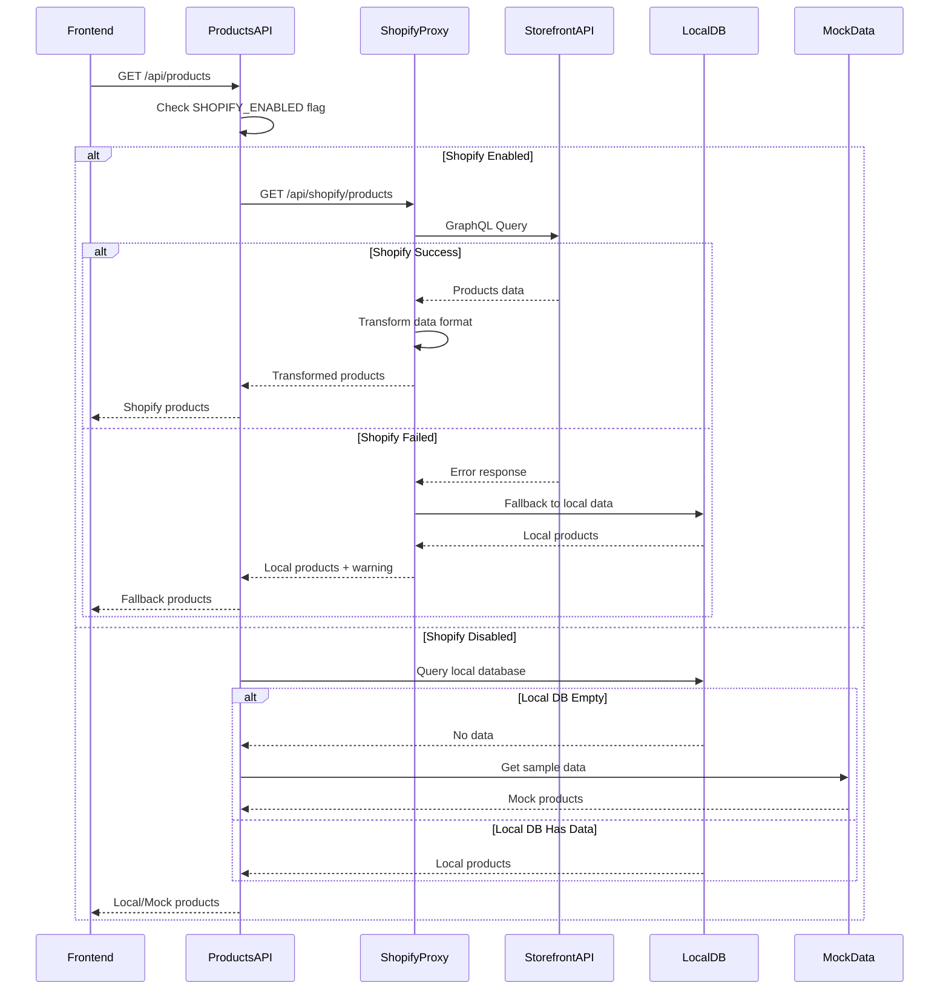
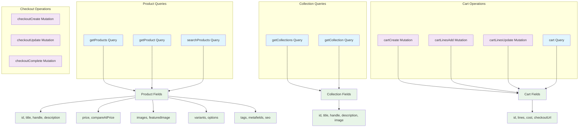
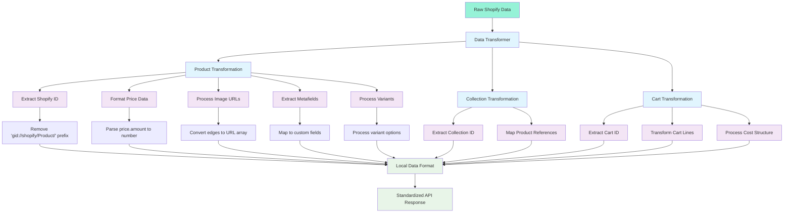
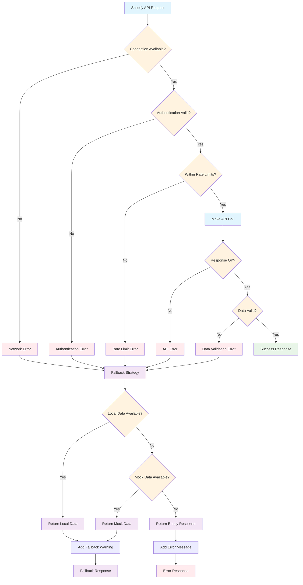
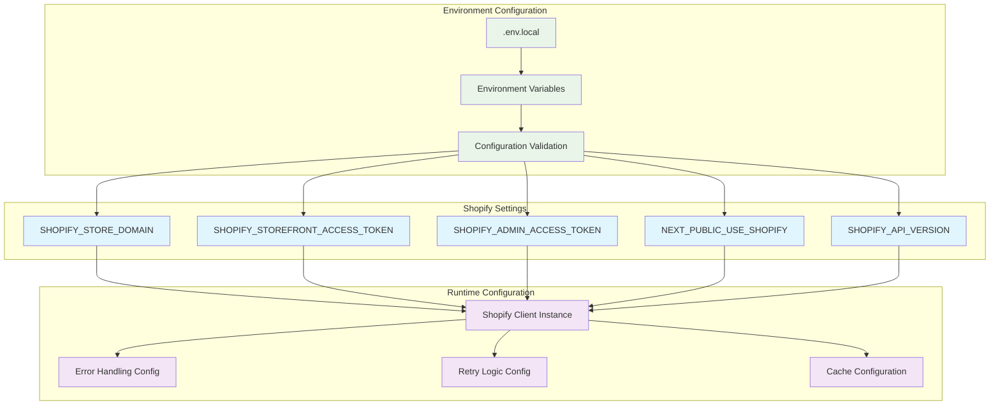
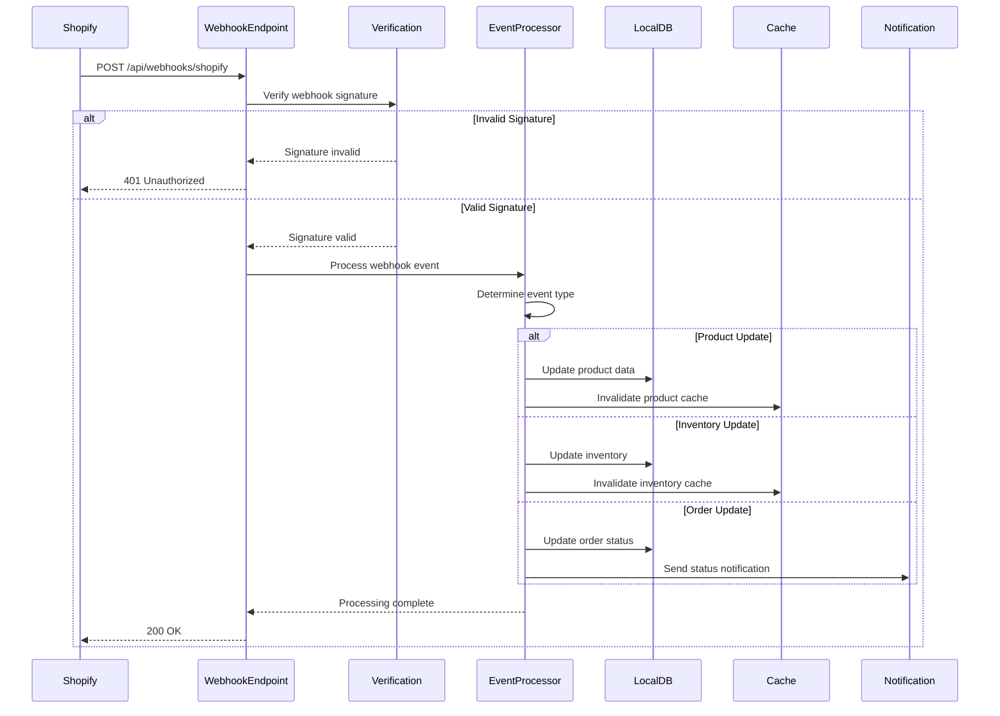
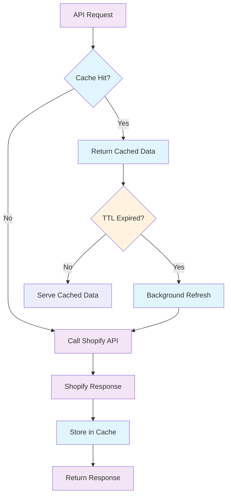

# Shopify Integration Architecture

## Shopify Integration Overview



## Shopify Storefront API Integration



## GraphQL Query Structure



## Data Transformation Layer



## Error Handling & Fallback Strategy



## Shopify Configuration Management



## Shopify Webhook Integration



## Performance Optimization Strategies

### Caching Strategy


### Rate Limiting Management
- **Storefront API**: 1000 requests per minute
- **Admin API**: 40 requests per app per store per minute
- **Retry Strategy**: Exponential backoff with jitter
- **Queue Management**: Request queuing during rate limits

### Data Synchronization
- **Real-time**: Webhooks for immediate updates
- **Batch Sync**: Scheduled synchronization jobs
- **Conflict Resolution**: Last-write-wins strategy
- **Partial Sync**: Incremental updates only

## Integration Testing Strategy

### Test Scenarios
1. **Happy Path**: Successful Shopify API calls
2. **Network Failure**: Shopify API unavailable
3. **Authentication Error**: Invalid API tokens
4. **Rate Limiting**: API rate limits exceeded
5. **Data Corruption**: Invalid response data
6. **Partial Failure**: Some products fail to load

### Mock Data Strategy
```typescript
// Mock data structure matches Shopify format
const mockShopifyProduct = {
  id: 'gid://shopify/Product/123',
  title: 'Test Product',
  handle: 'test-product',
  variants: {
    edges: [
      {
        node: {
          id: 'gid://shopify/ProductVariant/456',
          price: { amount: '29.99', currencyCode: 'USD' }
        }
      }
    ]
  }
}
```

## Monitoring & Observability

### Key Metrics
- **API Response Time**: < 500ms average
- **Success Rate**: > 99.5%
- **Fallback Usage**: < 5% of requests
- **Cache Hit Rate**: > 80%

### Error Tracking
- **Shopify API Errors**: Rate limits, authentication failures
- **Network Errors**: Connection timeouts, DNS failures
- **Data Errors**: Invalid response format, missing fields
- **Fallback Triggers**: When and why fallbacks are used

### Alerting
- **High Error Rate**: > 5% error rate for 5 minutes
- **Fallback Mode**: Extended fallback usage
- **Rate Limit Warnings**: Approaching API limits
- **Webhook Failures**: Webhook processing errors