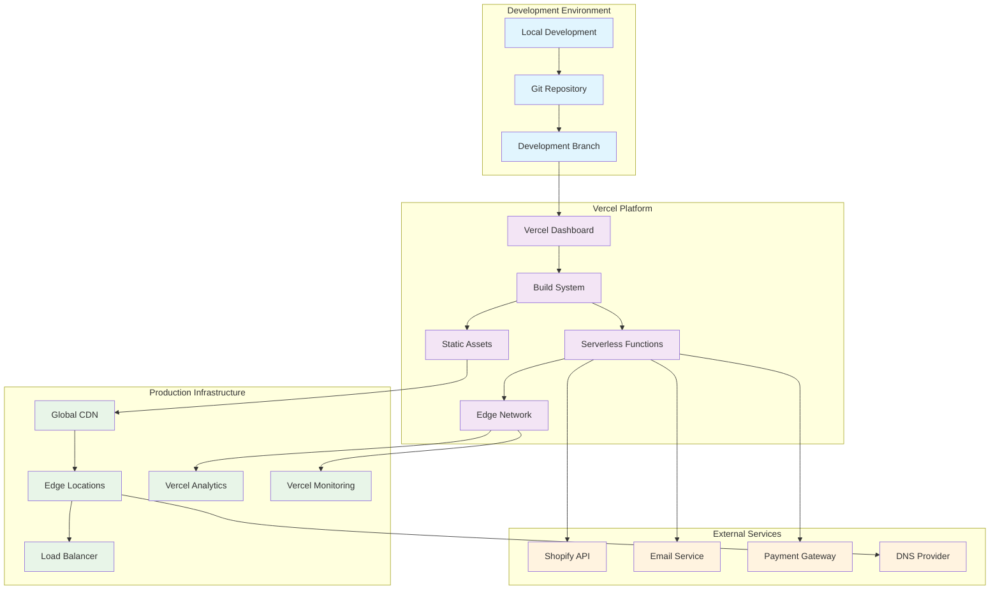
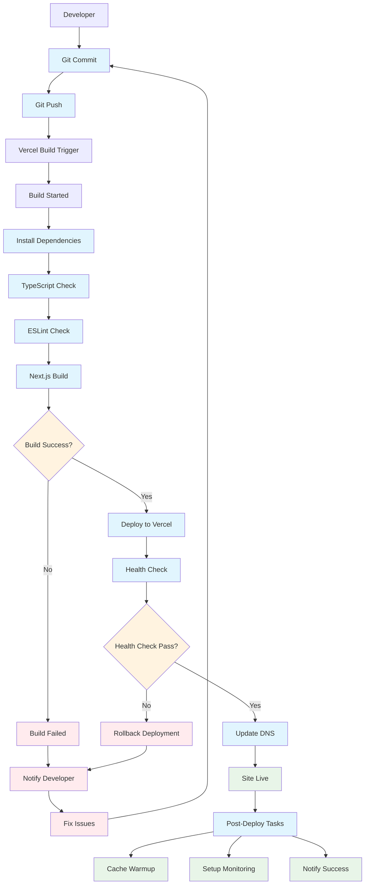
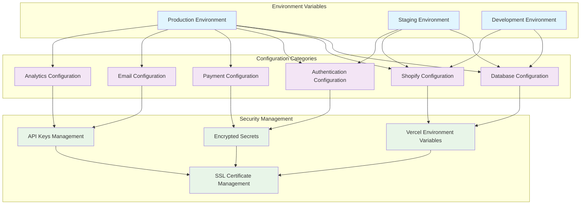

# Deployment & Infrastructure

## Vercel Deployment Architecture



## CI/CD Pipeline



## Environment Configuration



## Serverless Functions Architecture

```mermaid
graph TB
    subgraph "API Routes Structure"
        APIRoutes[/api/*]
        ProductsAPI[/api/products]
        CartAPI[/api/cart]
        AuthAPI[/api/auth/*]
