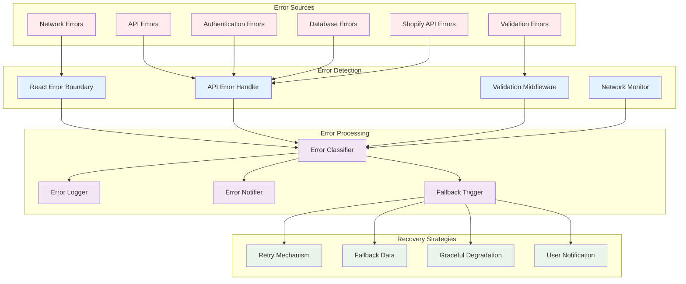
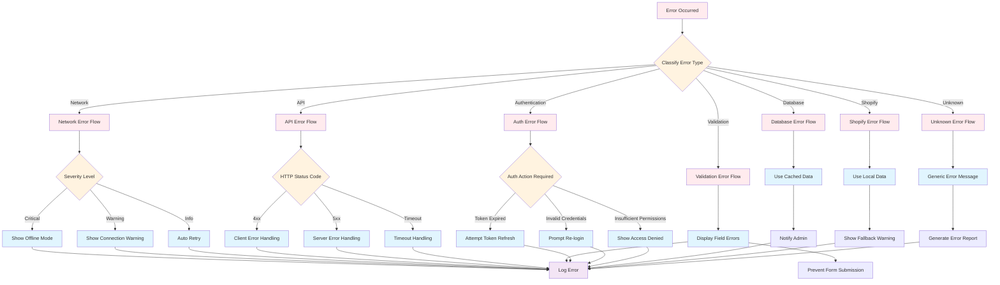
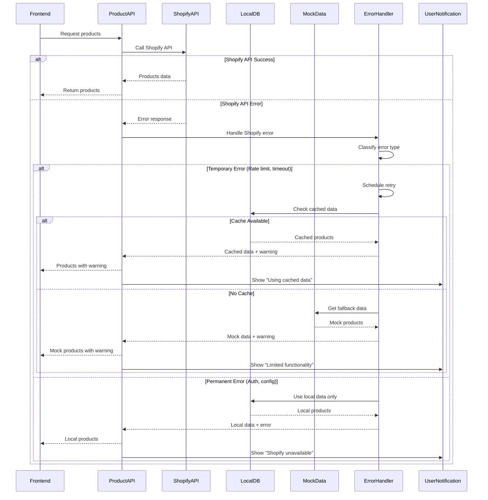
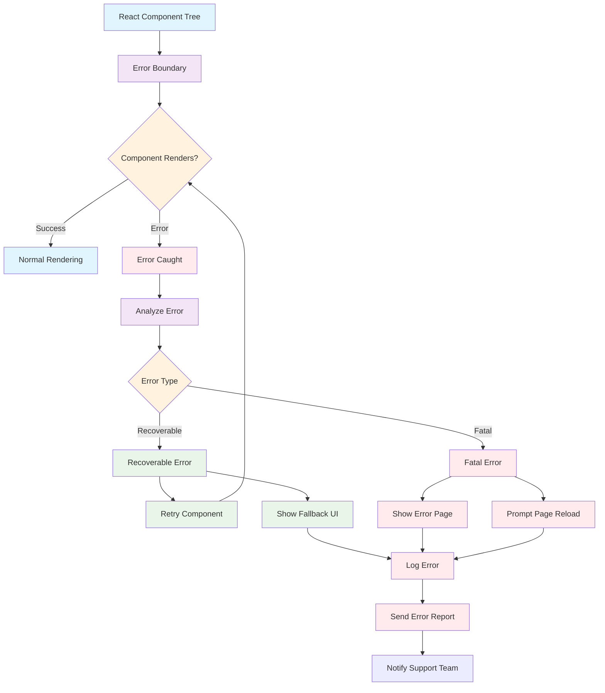
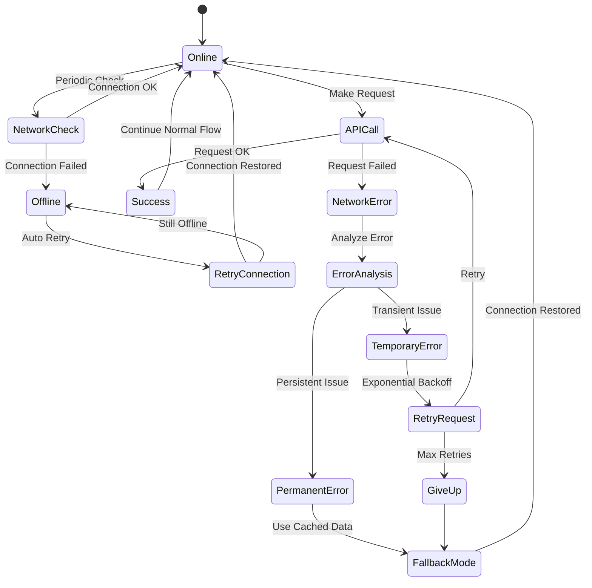
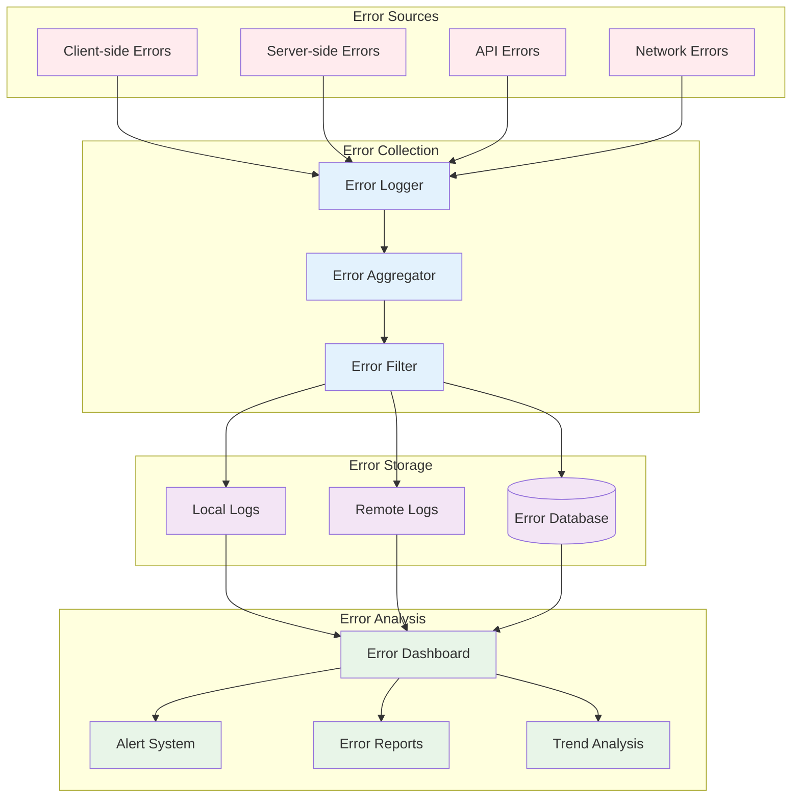
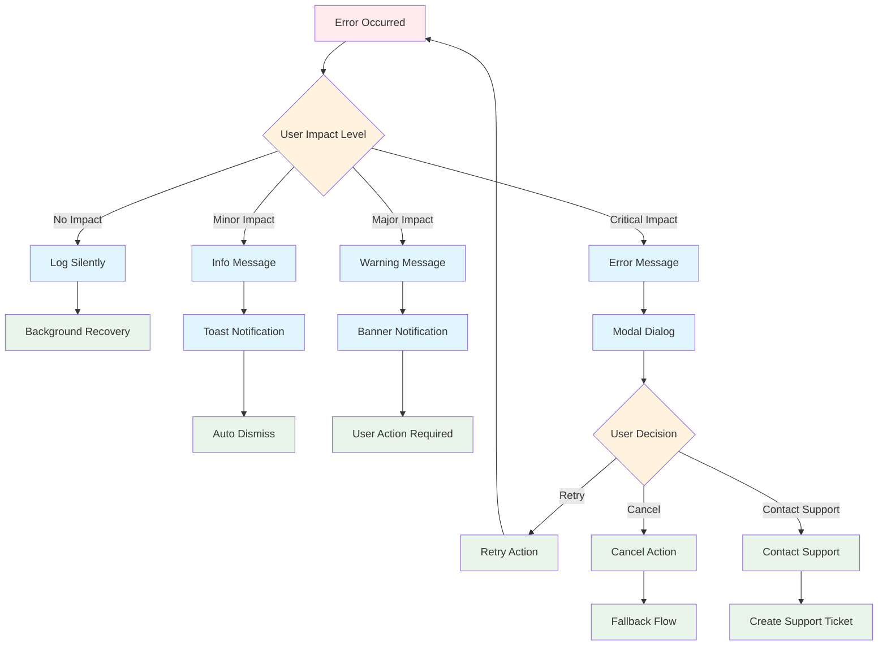
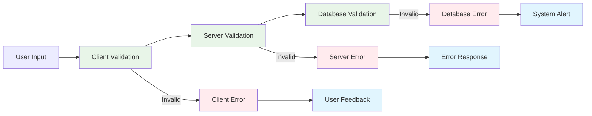

# Error Handling & Fallback Flow

## Error Handling Architecture Overview



## Error Classification & Response Flow



## Shopify API Fallback Strategy



## React Error Boundary Implementation



## Network Error Handling



## Error Logging & Monitoring



## User-Facing Error Messages



## Error Recovery Strategies

### Retry Mechanisms
```typescript
// Exponential backoff with jitter
const retryWithBackoff = async (
  operation: () => Promise<any>,
  maxRetries: number = 3,
  baseDelay: number = 1000
) => {
  for (let attempt = 0; attempt < maxRetries; attempt++) {
    try {
      return await operation()
    } catch (error) {
      if (attempt === maxRetries - 1) throw error
      
      const delay = baseDelay * Math.pow(2, attempt)
      const jitter = Math.random() * 0.1 * delay
      await new Promise(resolve => setTimeout(resolve, delay + jitter))
    }
  }
}
```

### Circuit Breaker Pattern
```typescript
class CircuitBreaker {
  private failures = 0
  private lastFailureTime = 0
  private state: 'CLOSED' | 'OPEN' | 'HALF_OPEN' = 'CLOSED'
  
  async execute<T>(operation: () => Promise<T>): Promise<T> {
    if (this.state === 'OPEN') {
      if (Date.now() - this.lastFailureTime > this.timeout) {
        this.state = 'HALF_OPEN'
      } else {
        throw new Error('Circuit breaker is OPEN')
      }
    }
    
    try {
      const result = await operation()
      this.onSuccess()
      return result
    } catch (error) {
      this.onFailure()
      throw error
    }
  }
}
```

## Error Prevention Strategies

### Input Validation


### Error Boundaries Placement
- **Page Level**: Catch page-specific errors
- **Component Level**: Catch component-specific errors
- **Route Level**: Catch routing errors
- **Global Level**: Catch application-wide errors

### Monitoring & Alerting Rules

1. **Critical Alerts** (Immediate Response)
   - Error rate > 5% for 5 minutes
   - API response time > 5 seconds
   - Shopify API completely unavailable

2. **Warning Alerts** (Within 1 hour)
   - Error rate > 2% for 15 minutes
   - Fallback mode activated
   - High retry rates

3. **Info Alerts** (Daily Summary)
   - Error trends and patterns
   - Performance degradation
   - User experience metrics

### Error Message Guidelines

1. **Be Specific**: Explain what went wrong
2. **Be Actionable**: Tell users what they can do
3. **Be Empathetic**: Acknowledge the inconvenience
4. **Be Consistent**: Use consistent language and tone
5. **Be Helpful**: Provide next steps or alternatives

### Example Error Messages
```typescript
const errorMessages = {
  network: {
    title: "Connection Problem",
    message: "We're having trouble connecting to our servers. Please check your internet connection and try again.",
    action: "Retry"
  },
  shopify: {
    title: "Limited Functionality",
    message: "Some features may be temporarily unavailable. You can still browse our catalog using cached data.",
    action: "Continue Browsing"
  },
  validation: {
    title: "Please Check Your Information",
    message: "Some fields need your attention before we can continue.",
    action: "Review Form"
  }
}
```

## Performance Impact of Error Handling

### Error Handling Overhead
- **Error Boundaries**: ~1-2ms per boundary
- **Try-Catch Blocks**: ~0.1ms per block
- **Error Logging**: ~5-10ms per log entry
- **Retry Logic**: Variable based on retry count

### Optimization Strategies
- **Lazy Error Reporting**: Batch error reports
- **Error Sampling**: Sample non-critical errors
- **Async Error Handling**: Don't block user interactions
- **Error Caching**: Cache error responses to prevent repeated failures