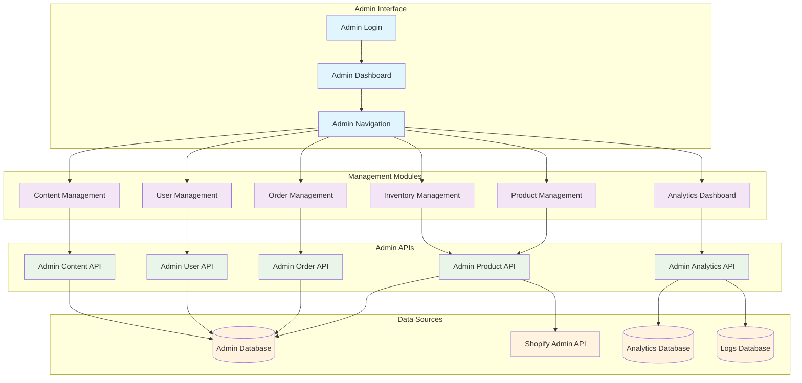
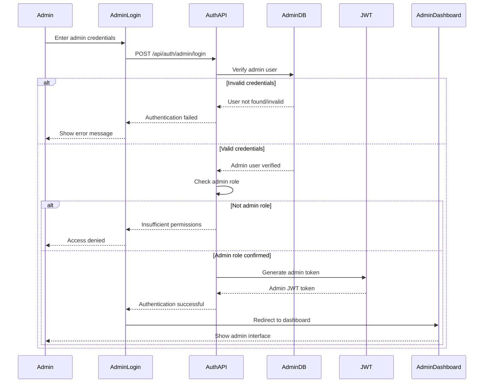
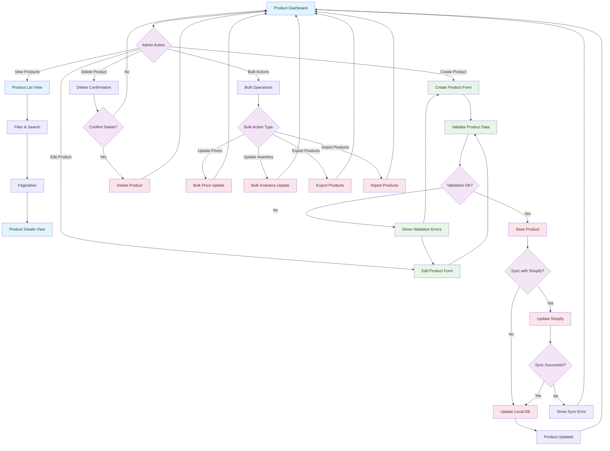
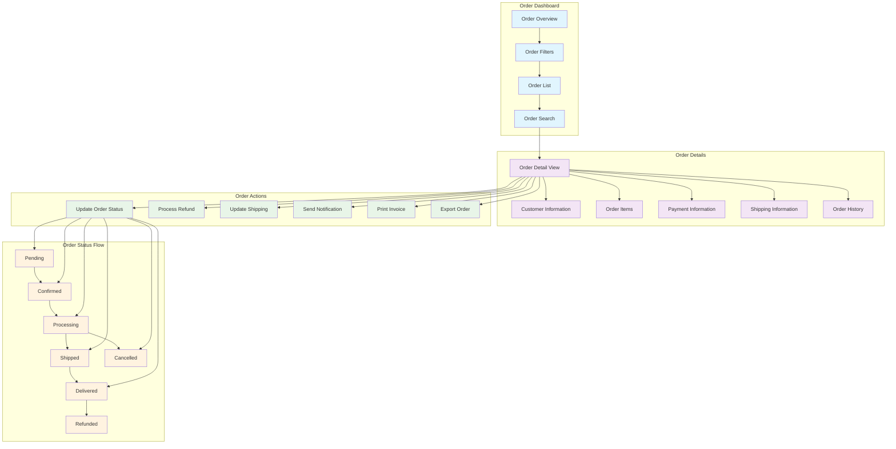
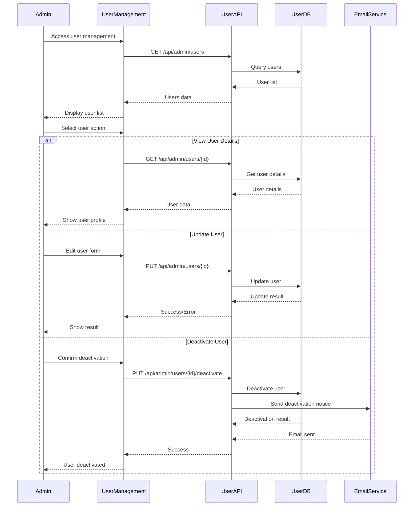
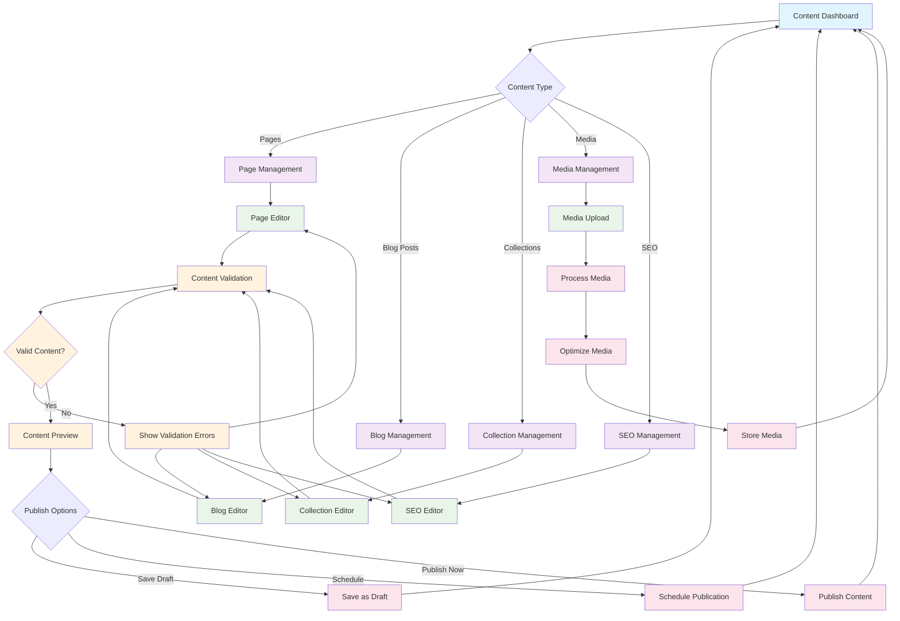
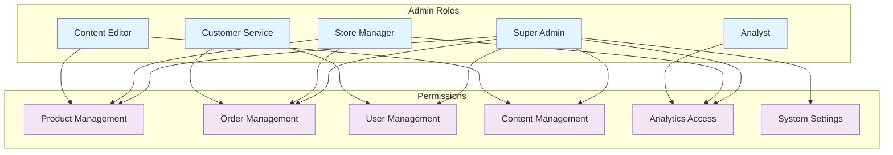
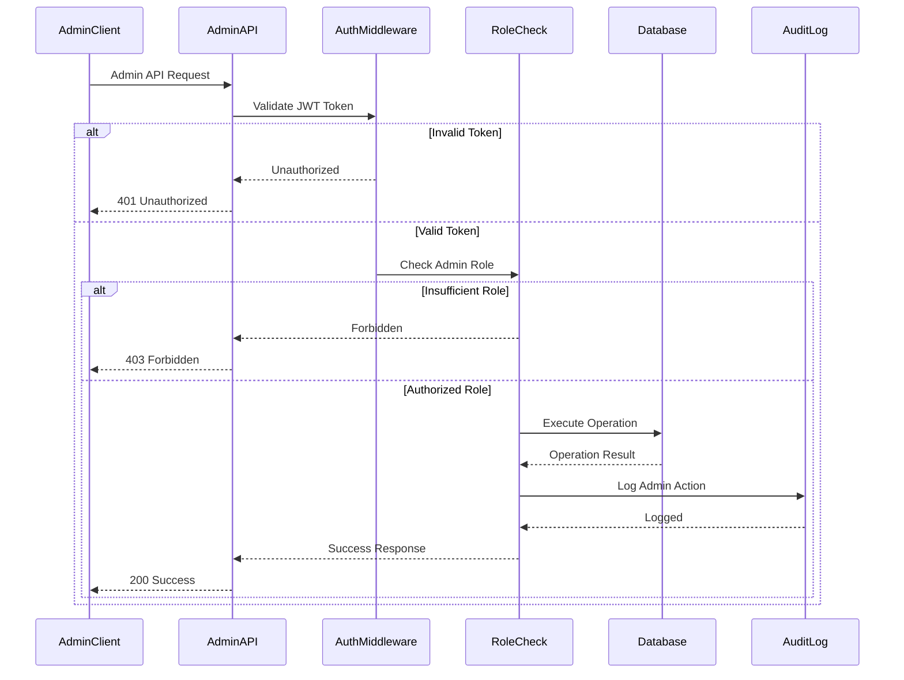
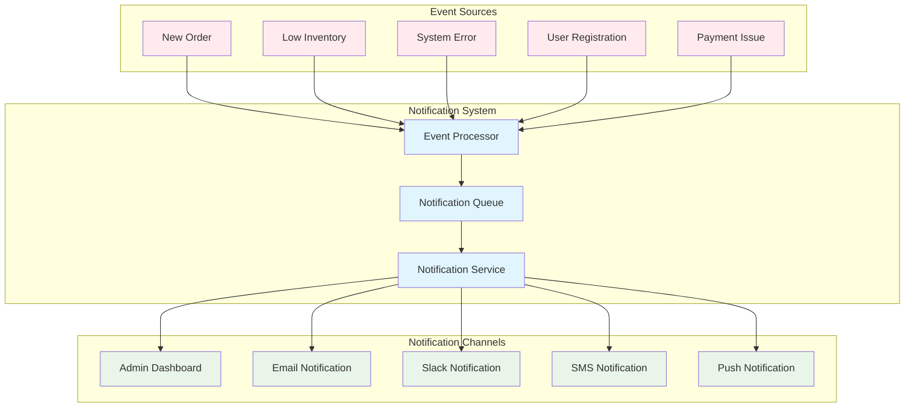

# Admin Dashboard & Management Flow

## Admin Dashboard Architecture

## Admin Authentication & Authorization Flow

## Product Management Flow

## Order Management System

## Analytics Dashboard Components

```mermaid
graph TB
    subgraph "Key Metrics"
        TotalRevenue[Total Revenue]
        OrderCount[Order Count]
        AverageOrderValue[Average Order Value]
        ConversionRate[Conversion Rate]
        CustomerCount[Customer Count]
        ProductViews[Product Views]
    end
    
    subgraph "Charts & Graphs"
        RevenueChart[Revenue Chart]
        OrdersChart[Orders Chart]
        ProductChart[Product Performance]
        CustomerChart[Customer Analytics]
        TrafficChart[Traffic Analytics]
        ConversionChart[Conversion Funnel]
    end
    
    subgraph "Reports"
        SalesReport[Sales Report]
        ProductReport[Product Report]
        CustomerReport[Customer Report]
        InventoryReport[Inventory Report]
        MarketingReport[Marketing Report]
    end
    
    subgraph "Data Filters"
        DateRange[Date Range]
        ProductFilter[Product Filter]
        CustomerSegment[Customer Segment]
        GeographicFilter[Geographic Filter]
        ChannelFilter[Channel Filter]
    end
    
    TotalRevenue --> RevenueChart
    OrderCount --> OrdersChart
    AverageOrderValue --> RevenueChart
    ConversionRate --> ConversionChart
    CustomerCount --> CustomerChart
    ProductViews --> TrafficChart
    
    RevenueChart --> SalesReport
    OrdersChart --> SalesReport
    ProductChart --> ProductReport
    CustomerChart --> CustomerReport
    TrafficChart --> MarketingReport
    
    DateRange --> RevenueChart
    DateRange --> OrdersChart
    ProductFilter --> ProductChart
    CustomerSegment --> CustomerChart
    GeographicFilter --> CustomerChart
    ChannelFilter --> TrafficChart
    
    classDef metrics fill:#e1f5fe
    classDef charts fill:#f3e5f5
    classDef reports fill:#e8f5e8
    classDef filters fill:#fff3e0
    
    class TotalRevenue,OrderCount,AverageOrderValue,ConversionRate,CustomerCount,ProductViews metrics
    class RevenueChart,OrdersChart,ProductChart,CustomerChart,TrafficChart,ConversionChart charts
    class SalesReport,ProductReport,CustomerReport,InventoryReport,MarketingReport reports
    class DateRange,ProductFilter,CustomerSegment,GeographicFilter,ChannelFilter filters
```

## User Management Interface

## Content Management System

## Admin Dashboard Permissions Matrix

## Admin API Security

## Real-time Admin Notifications

## Admin Dashboard Performance Metrics

### Key Performance Indicators
- **Dashboard Load Time**: < 2 seconds
- **API Response Time**: < 500ms
- **Data Refresh Rate**: Real-time for critical metrics
- **Concurrent Admin Users**: Up to 10 simultaneous users
- **Report Generation Time**: < 30 seconds for complex reports

### Optimization Strategies
- **Data Caching**: Cache frequently accessed data
- **Lazy Loading**: Load components on demand
- **Pagination**: Limit data per page
- **Background Processing**: Process heavy operations asynchronously
- **CDN Usage**: Serve static assets from CDN

### Security Measures
- **Role-Based Access Control**: Granular permissions
- **Audit Logging**: Track all admin actions
- **Session Management**: Secure admin sessions
- **IP Whitelisting**: Restrict admin access by IP
- **Two-Factor Authentication**: Additional security layer

### Monitoring & Alerting
- **Admin Activity Monitoring**: Track admin actions
- **Performance Monitoring**: Monitor dashboard performance
- **Error Tracking**: Track and alert on errors
- **Usage Analytics**: Analyze admin dashboard usage
- **Security Monitoring**: Monitor for suspicious activity