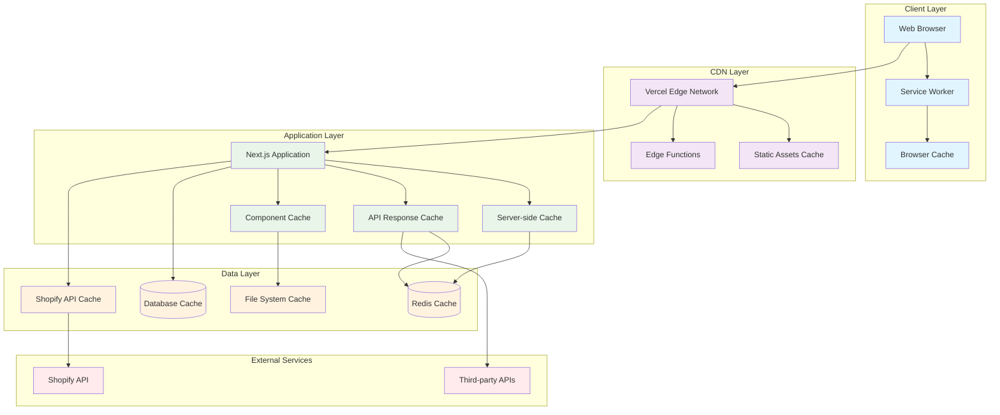
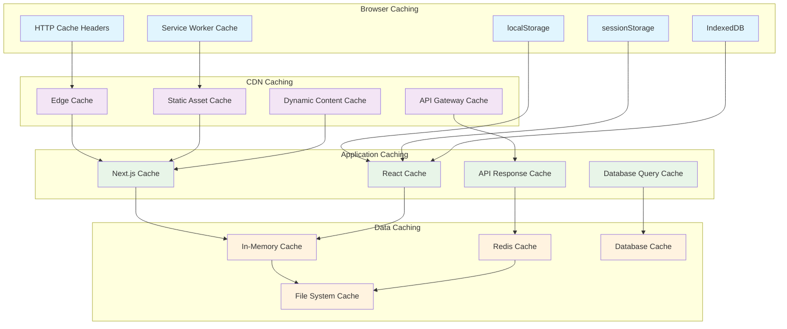
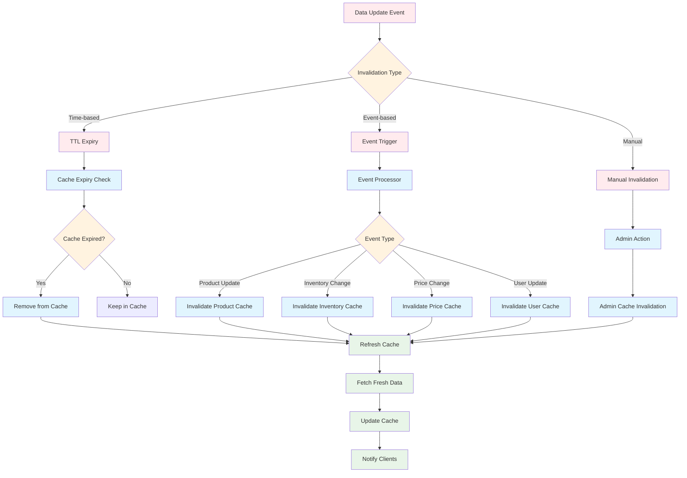
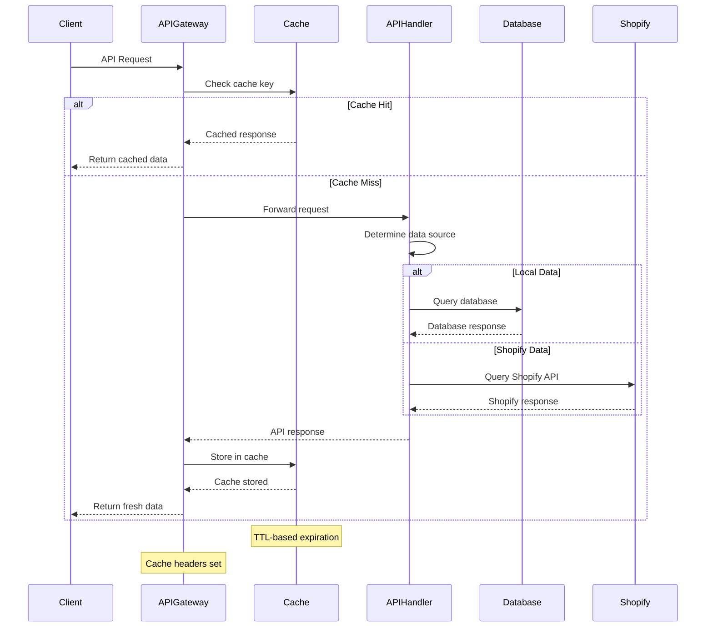
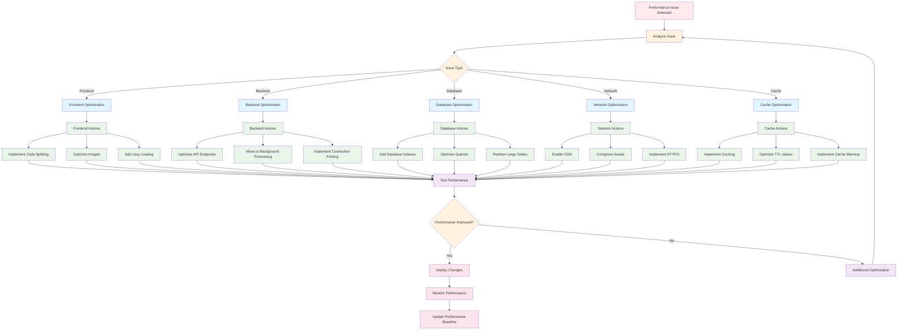

# Performance & Caching Strategy

## Performance Architecture Overview

## Caching Strategy by Layer

## Cache Invalidation Strategy

## API Response Caching Flow

## Performance Optimization Techniques

```mermaid
graph TB
    subgraph "Frontend Optimizations"
        CodeSplitting[Code Splitting]
        LazyLoading[Lazy Loading]
        ImageOptimization[Image Optimization]
        TreeShaking[Tree Shaking]
        Minification[Minification]
        Compression[Compression]
    end
    
    subgraph "Backend Optimizations"
        DatabaseIndexing[Database Indexing]
        QueryOptimization[Query Optimization]
        ConnectionPooling[Connection Pooling]
        BackgroundJobs[Background Jobs]
        APIOptimization[API Optimization]
        CacheWarmup[Cache Warmup]
    end
    
    subgraph "Network Optimizations"
        CDNUsage[CDN Usage]
        HTTPCaching[HTTP Caching]
        Prefetching[Resource Prefetching]
        ServiceWorkers[Service Workers]
        HTTP2[HTTP/2]
        EdgeComputing[Edge Computing]
    end
    
    subgraph "Monitoring & Metrics"
        PerformanceMonitoring[Performance Monitoring]
        RealUserMonitoring[Real User Monitoring]
        SyntheticMonitoring[Synthetic Monitoring]
        ErrorTracking[Error Tracking]
        PerformanceBudgets[Performance Budgets]
    end
    
    CodeSplitting --> PerformanceMonitoring
    LazyLoading --> PerformanceMonitoring
    ImageOptimization --> PerformanceMonitoring
    TreeShaking --> PerformanceMonitoring
    Minification --> PerformanceMonitoring
    Compression --> PerformanceMonitoring
    
    DatabaseIndexing --> RealUserMonitoring
    QueryOptimization --> RealUserMonitoring
    ConnectionPooling --> RealUserMonitoring
    BackgroundJobs --> RealUserMonitoring
    APIOptimization --> RealUserMonitoring
    CacheWarmup --> RealUserMonitoring
    
    CDNUsage --> SyntheticMonitoring
    HTTPCaching --> SyntheticMonitoring
    Prefetching --> SyntheticMonitoring
    ServiceWorkers --> SyntheticMonitoring
    HTTP2 --> SyntheticMonitoring
    EdgeComputing --> SyntheticMonitoring
    
    classDef frontend fill:#e1f5fe
    classDef backend fill:#f3e5f5
    classDef network fill:#e8f5e8
    classDef monitoring fill:#fff3e0
    
    class CodeSplitting,LazyLoading,ImageOptimization,TreeShaking,Minification,Compression frontend
    class DatabaseIndexing,QueryOptimization,ConnectionPooling,BackgroundJobs,APIOptimization,CacheWarmup backend
    class CDNUsage,HTTPCaching,Prefetching,ServiceWorkers,HTTP2,EdgeComputing network
    class PerformanceMonitoring,RealUserMonitoring,SyntheticMonitoring,ErrorTracking,PerformanceBudgets monitoring
```

## Cache Configuration Matrix

```mermaid
graph TB
    subgraph "Static Assets"
        Images[Images: 1 year]
        CSS[CSS: 1 year]
        JavaScript[JavaScript: 1 year]
        Fonts[Fonts: 1 year]
    end
    
    subgraph "Dynamic Content"
        ProductPages[Product Pages: 1 hour]
        CollectionPages[Collection Pages: 30 minutes]
        HomePage[Home Page: 15 minutes]
        SearchResults[Search Results: 5 minutes]
    end
    
    subgraph "API Responses"
        ProductAPI[Product API: 30 minutes]
        InventoryAPI[Inventory API: 5 minutes]
        UserAPI[User API: 15 minutes]
        CartAPI[Cart API: No cache]
    end
    
    subgraph "Database Queries"
        ProductQueries[Product Queries: 1 hour]
        UserQueries[User Queries: 30 minutes]
        OrderQueries[Order Queries: 15 minutes]
        AnalyticsQueries[Analytics Queries: 5 minutes]
    end
    
    Images --> CDNCache[CDN Cache]
    CSS --> CDNCache
    JavaScript --> CDNCache
    Fonts --> CDNCache
    
    ProductPages --> EdgeCache2[Edge Cache]
    CollectionPages --> EdgeCache2
    HomePage --> EdgeCache2
    SearchResults --> EdgeCache2
    
    ProductAPI --> RedisCache3[Redis Cache]
    InventoryAPI --> RedisCache3
    UserAPI --> RedisCache3
    CartAPI --> NoCache[No Cache]
    
    ProductQueries --> DatabaseCache3[Database Cache]
    UserQueries --> DatabaseCache3
    OrderQueries --> DatabaseCache3
    AnalyticsQueries --> DatabaseCache3
    
    classDef static fill:#e8f5e8
    classDef dynamic fill:#e1f5fe
    classDef api fill:#f3e5f5
    classDef database fill:#fff3e0
    classDef cache fill:#fce4ec
    
    class Images,CSS,JavaScript,Fonts static
    class ProductPages,CollectionPages,HomePage,SearchResults dynamic
    class ProductAPI,InventoryAPI,UserAPI,CartAPI api
    class ProductQueries,UserQueries,OrderQueries,AnalyticsQueries database
    class CDNCache,EdgeCache2,RedisCache3,NoCache,DatabaseCache3 cache
```

## Performance Monitoring Dashboard

```mermaid
graph TB
    subgraph "Core Web Vitals"
        LCP[Largest Contentful Paint]
        FID[First Input Delay]
        CLS[Cumulative Layout Shift]
        FCP[First Contentful Paint]
        TTFB[Time to First Byte]
    end
    
    subgraph "Custom Metrics"
        PageLoadTime[Page Load Time]
        APIResponseTime[API Response Time]
        DatabaseQueryTime[Database Query Time]
        CacheHitRate[Cache Hit Rate]
        ErrorRate[Error Rate]
    end
    
    subgraph "User Experience Metrics"
        BounceRate[Bounce Rate]
        SessionDuration[Session Duration]
        PageViews[Page Views per Session]
        ConversionRate2[Conversion Rate]
        UserSatisfaction[User Satisfaction Score]
    end
    
    subgraph "Infrastructure Metrics"
        CPUUsage[CPU Usage]
        MemoryUsage[Memory Usage]
        NetworkLatency[Network Latency]
        DiskIO[Disk I/O]
        CacheMemory[Cache Memory Usage]
    end
    
    LCP --> PerformanceScore[Performance Score]
    FID --> PerformanceScore
    CLS --> PerformanceScore
    FCP --> PerformanceScore
    TTFB --> PerformanceScore
    
    PageLoadTime --> UserExperience[User Experience Score]
    APIResponseTime --> UserExperience
    DatabaseQueryTime --> UserExperience
    CacheHitRate --> UserExperience
    ErrorRate --> UserExperience
    
    BounceRate --> BusinessMetrics[Business Impact Score]
    SessionDuration --> BusinessMetrics
    PageViews --> BusinessMetrics
    ConversionRate2 --> BusinessMetrics
    UserSatisfaction --> BusinessMetrics
    
    CPUUsage --> SystemHealth[System Health Score]
    MemoryUsage --> SystemHealth
    NetworkLatency --> SystemHealth
    DiskIO --> SystemHealth
    CacheMemory --> SystemHealth
    
    classDef vitals fill:#e1f5fe
    classDef custom fill:#f3e5f5
    classDef ux fill:#e8f5e8
    classDef infra fill:#fff3e0
    classDef score fill:#fce4ec
    
    class LCP,FID,CLS,FCP,TTFB vitals
    class PageLoadTime,APIResponseTime,DatabaseQueryTime,CacheHitRate,ErrorRate custom
    class BounceRate,SessionDuration,PageViews,ConversionRate2,UserSatisfaction ux
    class CPUUsage,MemoryUsage,NetworkLatency,DiskIO,CacheMemory infra
    class PerformanceScore,UserExperience,BusinessMetrics,SystemHealth score
```

## Performance Optimization Workflow

## Performance Budget & Targets

### Performance Targets
- **First Contentful Paint (FCP)**: < 1.5s
- **Largest Contentful Paint (LCP)**: < 2.5s
- **First Input Delay (FID)**: < 100ms
- **Cumulative Layout Shift (CLS)**: < 0.1
- **Time to First Byte (TTFB)**: < 600ms

### Resource Budgets
- **JavaScript Bundle**: < 200KB (gzipped)
- **CSS Bundle**: < 50KB (gzipped)
- **Images per Page**: < 1MB total
- **Fonts**: < 100KB total
- **Third-party Scripts**: < 50KB

### API Performance Targets
- **Product API**: < 200ms response time
- **Search API**: < 300ms response time
- **Cart API**: < 150ms response time
- **User API**: < 100ms response time
- **Checkout API**: < 500ms response time

### Cache Performance Targets
- **Cache Hit Rate**: > 80%
- **Cache Response Time**: < 10ms
- **Cache Memory Usage**: < 512MB
- **Cache Invalidation Time**: < 5s
- **Cache Warmup Time**: < 30s

### Monitoring Alerts
- **Performance Score < 90**: Warning alert
- **Performance Score < 70**: Critical alert
- **API Response Time > 1s**: Warning alert
- **API Response Time > 2s**: Critical alert
- **Cache Hit Rate < 70%**: Warning alert
- **Error Rate > 1%**: Critical alert

### Optimization Priorities
1. **Critical Path Optimization**: Optimize resources needed for initial render
2. **Code Splitting**: Split JavaScript bundles by route
3. **Image Optimization**: Implement next-gen image formats and lazy loading
4. **API Caching**: Implement comprehensive API response caching
5. **Database Optimization**: Add indexes and optimize queries
6. **CDN Implementation**: Serve all static assets from CDN